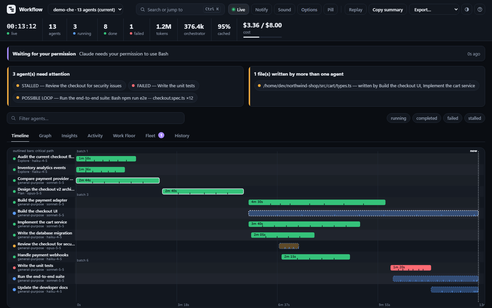

# Workflow

See what your Claude Code subagents are actually doing.

Workflow reads the transcripts Claude Code already writes and reconstructs the
whole orchestration: how many agents ran, what each was asked to do, what each
was expected to produce, which are still going, which are stuck, and which
agent's output became which other agent's input.



## Try it without a real run

```bash
python -m orchestra --demo
```

Serves a scripted 13-agent run (parallel waves, a nested agent, handoffs, a failure,
a possible loop, a stalled agent, a write conflict, a pending permission prompt and
demo prices) from a throwaway directory, and keeps the running agents moving so the
live views have something to show. It never touches your real `~/.claude`; Ctrl+C
removes everything it made.

## Install

```bash
/plugin marketplace add <this repo>
/plugin install workflow
```

Requires Python 3.9 or newer. Nothing else — no pip install, no npm, no build.

## Use

| Command | What it does |
|---|---|
| `/workflow:open` | Start the dashboard and open it |
| `/workflow:open stop` | Shut the server down |
| `/workflow:open report` | Write a self-contained HTML snapshot you can share |

From a terminal, outside Claude Code:
`python -m orchestra --session <id> --export csv|json [--out PATH]` writes the
run as CSV (one row per agent) or JSON. The dashboard's **Export** menu does the
same. Exports contain only what the dashboard shows (already redacted), and CSV
cells a spreadsheet would execute as formulas are neutralised.

## What you get

- **Insights** — the questions a run raises once it is over (or half over):
  how parallel it really was, **the critical path** (the chain of agents that set
  its length; speeding up anything else will not finish it sooner), which tools
  and files dominated, the prompt-cache hit rate, who used the most fresh tokens,
  and, with a price file, where the money went and when a budget runs out at the
  current burn rate.
- **Search and shortcuts** — `Ctrl/Cmd+K` (or `/`) opens one box for agents,
  tool calls, files and commands. Number keys switch views; `L` pauses live
  updates, `R` replays, `T` changes the theme, `?` lists every shortcut. Shortcuts
  never fire while you are typing. Search matches the redacted text only.
- **Light, dark or automatic** — designed together, with text and status colours
  held to WCAG 4.5:1 by a test; follows reduced-motion; usable at phone width.

- **Timeline** — one row per agent: a status dot, a duration bar, parallel
  waves banded together. A still-running agent's dot pulses and its bar
  breathes, so "in progress" is never just a color you have to notice.
- **Graph** — who fed whom. Solid edges are exact (spawn, file handoff, direct
  message); dashed edges are inferred from text reuse and carry the snippet
  that produced them, so you can judge them yourself. The longest
  duration-weighted chain — the actual bottleneck, not just the longest hop
  count — is highlighted. Drag to pan, Ctrl/Cmd+wheel or the buttons to zoom,
  `0` to fit; hover an agent to fade everything unrelated to it. A newly-detected handoff flashes a dot
  traveling the edge the moment it happens.
- **Activity** — a merged, live, newest-first feed of tool calls across every
  running agent, click-through to the agent it came from.
- **Work Floor** — every agent as a small pixel-art sprite, animated by its
  status (idle, running, waving on completion, a one-shot jump burst the
  moment it finishes), tinted a stable per-agent hue so a busy floor still
  reads as distinct agents at a glance. Each card also shows what the agent is
  doing right now (its last tool call) and where it has been busy; group the
  floor by role or by status, with the agents that need a look first.
- **Drawer** — each agent's brief, its extracted objective and expected
  output, its returned result, its exact model version, a cache-hit
  breakdown, a tool-mix fingerprint (Read/Edit/Bash/Task at a glance), every
  tool call, and the files it read and wrote.
- **Filter bar** — free-text search plus status chips; narrows every view
  (Timeline, Graph, Activity) at once without ever hiding or reflowing
  anything.
- **Health & write-conflict boxes** — stalled, failed, and orphaned agents
  surfaced instead of buried, plus a flag for any file two agents wrote
  independently — a real correctness risk, not just informational.
- **Replay** — scrub or play back the run (1×-120×) to see who had launched,
  who was running and who had finished at any moment. Works in a static report
  too, so a post-mortem needs no server. Statuses are reconstructed from start
  and end times; token totals are shown as unavailable, not as wrong numbers.
- **Possible loops** — a still-running agent that has repeated the same tool
  call several times (or strictly alternated between two) is listed with the
  evidence. Reported as *possible*: legitimate polling looks the same.
- **Deep links** — every view and agent has a URL (`#view=insights&agent=<id>`), pasteable into a PR
  or a Slack thread, that opens straight to its drawer.
- **Notifications** — an optional desktop alert when an agent fails, the
  session ends, or Claude is waiting on your permission, for when you're not
  watching the tab.
- **Fleet** — every session active in the last few hours, across all projects,
  most urgent first (blocked on a permission prompt or an API error), with a
  tab badge and an alert when a session you are *not* looking at needs you.
  Click one to jump to it.
- **Pill** — a small always-on-top window (Chrome/Edge: click *Pill*) showing
  what needs you across all sessions, with a dot per agent. Every browser also
  gets a `(2) Workflow` tab title and a colored, counted favicon.
- **Sounds** — optional (click *Sound*). Three synthesized tones: needs you,
  something failed, all done. History never makes noise; at most one sound per
  update. No audio files, so nothing is fetched. *Options* mutes any one of the
  three and sets quiet hours (which silence all of them, failures included);
  both are remembered in this browser only.
- **Live** — updates arrive the moment a transcript or hook event changes
  (Server-Sent Events), not on a timer; polling is only a safety net.
- **Attention banner** — what the session is blocked on right now: a permission
  prompt, your input, or an API error such as `rate_limit`.
- **Copy summary** — one click produces a paste-ready markdown summary for a
  PR description or a status update.

## Live events (hooks)

Installing the plugin also registers small **async** Claude Code hooks for seven
events: session start/end, subagent start/stop, notifications, API failures and
turn end. They are what let Workflow say an agent is *waiting for your
permission*, or that it died to a rate limit — facts a transcript cannot show.

- Each hook records one line to `<state dir>/events/<session>.jsonl` and exits.
  It never blocks or fails Claude Code (async, always exit 0, silent), and costs
  roughly 50 ms of Python startup off Claude's critical path.
- Only the event name, session/agent ids, working directory, and a short
  redacted message are stored. **Tool inputs, prompts, and file contents are
  never recorded.** Per-tool events (`PreToolUse`/`PostToolUse`) are not hooked.
- The state directory is per-user, mode `0700`, never under `~/.claude`; spool
  files are deleted after 7 days.
- Turn recording off entirely with `ORCHESTRA_EVENTS=off` in the environment
  Claude Code runs in. The dashboard then works from transcripts alone.

## Cost and budget

Workflow shows what a run cost **only if you give it prices** — prices change
and differ by contract, so none are built in. Copy
[`docs/prices.example.json`](docs/prices.example.json) to
`~/.config/workflow/prices.json` (Windows: `%APPDATA%\workflow\prices.json`, or
point `ORCHESTRA_PRICES` at any file), replace the illustrative numbers with
yours, and the header gains a cost figure. The file is re-read when it changes.

- Cost covers the **orchestrator's own usage as well as every subagent's**, per
  model (a session can switch models). A model with no matching price is listed
  as unpriced and the total is marked *partial* rather than silently counting it
  as free.
- Set `ORCHESTRA_BUDGET` (in the price file's currency) to get a warning at 80 %
  of it and an alert when it is passed.

## Run history (opt-in)

Set `ORCHESTRA_HISTORY=on` to remember how past runs went and compare them
(agents, failures, wall time, tokens, cost, loops) in the **History** tab.

This is the one feature that keeps data after a session is gone, so it is off by
default and stores the least that answers the question: **metrics only** —
counts, durations, tokens, cost, and the project directory. No prompts, briefs,
results, task descriptions, or file paths. It lives in
`~/.local/share/workflow/history.sqlite` (Windows: `%LOCALAPPDATA%\workflow`),
mode `0600`, is pruned after 90 days / 500 runs, and deleting that file erases
it. A database problem never breaks the dashboard.

## Privacy

Workflow is local, and does not control Claude Code: it only observes.

- The server binds `127.0.0.1` only, and every API call requires a token minted
  at launch.
- There is no network egress of any kind: no CDN, no fonts, no telemetry. Every
  asset ships in the package.
- It never writes to any file under `~/.claude`.
- Anything that looks like a credential is redacted before it reaches the page.

## Configuration

Every threshold has a default and can be overridden with an environment
variable, read at startup. A missing, non-numeric, or out-of-range value is
ignored in favour of the default.

| Variable | Default | Meaning |
|---|---|---|
| `ORCHESTRA_STALL_SECONDS` | 300 | An agent with an open round and no activity this long reads as `stalled` |
| `ORCHESTRA_SESSION_LIVE_SECONDS` | 600 | A session whose transcript was touched this recently counts as live |
| `ORCHESTRA_HUB_FILE_THRESHOLD` | 3 | A file read by more agents than this, written by none, is shared context |
| `ORCHESTRA_HANDOFF_CONTAINMENT` | 0.15 | Text-reuse score (0-1) at which a handoff edge is inferred |
| `ORCHESTRA_HANDOFF_RUN_WORDS` | 40 | A shared run this many words long also infers a handoff |
| `ORCHESTRA_SHINGLE_SIZE` | 8 | Words per shingle in handoff scoring |
| `ORCHESTRA_IDLE_SHUTDOWN_SECONDS` | 1800 | The server exits after this long with no request |
| `ORCHESTRA_PORT` | 7717 | First port tried (it walks upward if taken) |
| `ORCHESTRA_MAX_BUILDERS` | 24 | Sessions kept in memory at once |
| `ORCHESTRA_FLEET_SECONDS` | 21600 | The Fleet view lists sessions active within this window |
| `ORCHESTRA_FLEET_MAX_SESSIONS` | 50 | Most sessions the Fleet view lists |
| `ORCHESTRA_PRICES` | `~/.config/workflow/prices.json` | Price table that enables cost (see above) |
| `ORCHESTRA_BUDGET` | 0 (off) | Per-session spend limit, in the price file's currency |
| `ORCHESTRA_BUDGET_WARN_RATIO` | 0.8 | Fraction of the budget at which warnings start |
| `ORCHESTRA_LOOP_REPEATS` | 6 | An open agent whose last N tool calls are identical is flagged as a possible loop |
| `ORCHESTRA_LOOP_CYCLE_CALLS` | 16 | ...or whose last N calls strictly alternate between two distinct calls |
| `ORCHESTRA_HISTORY` | off | `on` records run metrics for the History tab |
| `ORCHESTRA_HISTORY_DB` | `~/.local/share/workflow/history.sqlite` | Where history is kept |
| `ORCHESTRA_HISTORY_DAYS` | 90 | Runs older than this are deleted |
| `ORCHESTRA_HISTORY_MAX_RUNS` | 500 | Most runs kept |
| `ORCHESTRA_STATE_DIR` | per-user dir in the OS temp dir | Where port files, logs and the event spool live |
| `ORCHESTRA_EVENTS` | on | `off` stops the hooks recording anything |

## Development

```bash
python -m unittest discover -s tests -t . -v
```

Standard library only, tests included.

## How it works

For the full architecture — how transcripts are turned into a dashboard, the
exact formulas behind the status states and the graph's edges, and what every
feature shows and why — see [`docs/ARCHITECTURE.md`](docs/ARCHITECTURE.md).
