# Cuelight

Know the moment your Claude Code agents need you.

A cue light is the lamp a stage manager switches on to tell a performer *now*. Cuelight
does that for your agents: it tells you when one is waiting on you, has failed, or has gone
quiet, and shows the whole run behind it.


Keep the **pill** floating over your editor (one click in the dashboard) and a glance tells you
the state: asleep when quiet, working while agents run, hopping when one needs you, shaking on
an error. The browser tab icon shows the same face, so you see it even when the tab is hidden.

It reads the transcripts Claude Code already writes and reconstructs the
whole orchestration: how many agents ran, what each was asked to do, what each
was expected to produce, which are still going, which are stuck, and which
agent's output became which other agent's input.

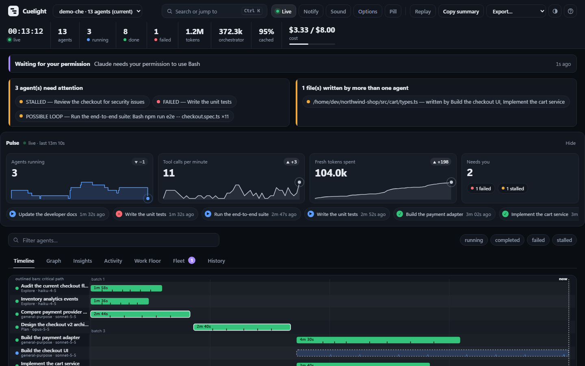

| Graph (who fed whom, critical path outlined) | Work Floor (what each agent is doing now) |
|---|---|
| 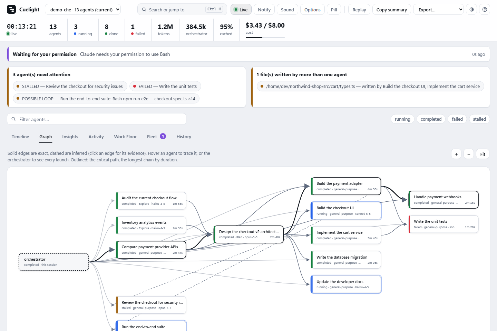 | 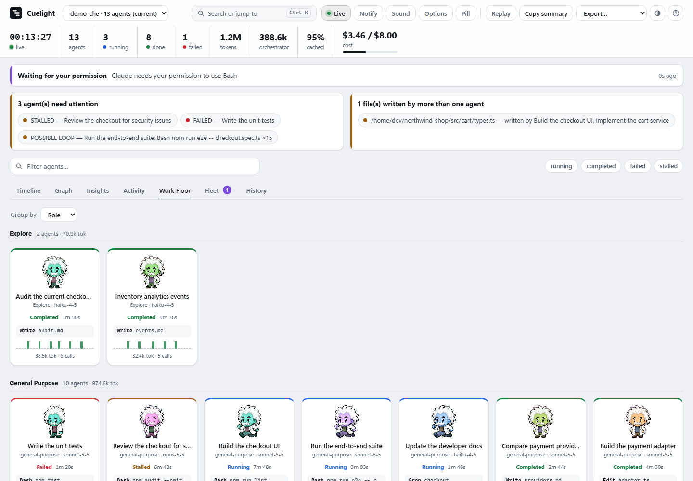 |

## Try it without a real run

```bash
python -m orchestra --demo
```

Serves a scripted 13-agent run (parallel waves, a nested agent, handoffs, a failure,
a possible loop, a stalled agent, a write conflict, a pending permission prompt and
demo prices) from a throwaway directory, and keeps the running agents moving so the
live views have something to show. It never touches your real `~/.claude`; Ctrl+C
removes everything it made.

## Install

```bash
/plugin marketplace add chandan12ar/cuelight
/plugin install cuelight@cuelight-marketplace
```

Requires Python 3.9 or newer. Nothing else — no pip install, no npm, no build.

## Use

| Command | What it does |
|---|---|
| `/cuelight:open` | Start the dashboard and open it |
| `/cuelight:open stop` | Shut the server down |
| `/cuelight:open report` | Write a self-contained HTML snapshot you can share |

From a terminal, outside Claude Code:
`python -m orchestra --session <id> --export csv|json [--out PATH]` writes the
run as CSV (one row per agent) or JSON. The dashboard's **Export** menu does the
same. Exports contain only what the dashboard shows (already redacted), and CSV
cells a spreadsheet would execute as formulas are neutralised.

## Example use cases

1. **Know when to switch back.** You start several subagents and move to another window. The pill turns
   surprised and says "Waiting for your permission", so you answer right away instead of finding out ten
   minutes later.
2. **Find what slowed a run down.** A long multi-agent run is slower than expected. The timeline, critical
   path and Pulse charts show which agent held everything up and where the tokens went.
3. **Watch several sessions at once.** With sessions open in different projects, the Fleet view lists which
   one needs you first, and the tab title shows how many are waiting.
4. **Catch a stuck agent.** An agent that has gone quiet is flagged as stalled, and a repeated tool call is
   flagged as a possible loop with the calls listed, so you can open it and decide before stopping it.
5. **Spot clashing edits.** When two agents write the same file, Cuelight names both so you can check the
   file before merging their work.
6. **Share a run.** Replay a finished run, then export a self-contained HTML report (secrets redacted) to
   send to a teammate or attach to a pull request.
7. **Catch work nobody tested.** An agent reports "done" but never ran the tests after its last edit, or
   its last test run failed. The Health box lists it with the file it edited and the last command it ran.
8. **Review what each agent changed.** Open an agent and read its diffs file by file, with line numbers,
   before you merge its work; the Insights card shows who changed the most and which files changed most.
9. **Know what a run delivered.** The Insights card lists the commits and pull requests the run made, how
   many test runs passed, and what each commit and pull request cost.
10. **Check every agent had your rules.** The Insights card shows which agents loaded your project's
    CLAUDE.md and rules files, and names any that ran without them.
11. **See what your approvals cost.** The Insights card "Waiting on you" shows how long agents sat on your
   permission prompts, which agent waited longest, and how much agent time was lost while several waited
   at once, so you can decide which tools to pre-approve.
12. **Pick up where you left off.** Coming back to three sessions in the same project, the Fleet view
    names each by its title and shows Claude Code's own "while you were away" recap, so you know which
    one to open first and what it was doing.
13. **See what a coffee break cost.** Left a big session idle for an hour? The Insights card "Where tokens
    were wasted" shows the prompt cache was written again from scratch when you came back, how many
    tokens that was, what it cost above the cheap cache-read price, and whether you were sitting on a
    permission prompt at the time.
14. **Find the prompt that cost the most.** The Prompts tab lists each message you sent,
    how long the work it started took, how much of that was agents running or you being asked, and what
    it cost, so "that one request was 40% of the session" is something you can see.
15. **Know before a long session forgets.** The Insights card "How full each context got" draws the main
    session's context on every call with a mark at each compaction, ranks agents by how full they got,
    and puts a session or a running agent that is near its window in the Health box, before Claude Code
    compacts it and detail from earlier is lost.
16. **See what a session limit cost you.** The Insights card "What went wrong" lists each API error
    (usage limits, expired logins, an overloaded API) with how long nothing happened until the API
    answered again, which tools failed most, which failed calls were tried again and whether that
    worked, and commands that ran past their timeout. An agent still failing the same call three times
    in a row goes in the Health box.

You can try every one of these without a real run: `python -m orchestra --demo`.

## What you get

- **Pulse** — a live strip above every view, like a ticker for the run: agents running,
  tool calls per minute, fresh tokens spent, and what needs you, each with a chart that
  moves as the run does, a change arrow against the previous minute, and a tape of what
  just started, finished, failed or went quiet. Every line is a real series from the
  transcripts (nothing smoothed or estimated, the y-axis always starts at zero), and
  hovering a chart reads the exact value.

  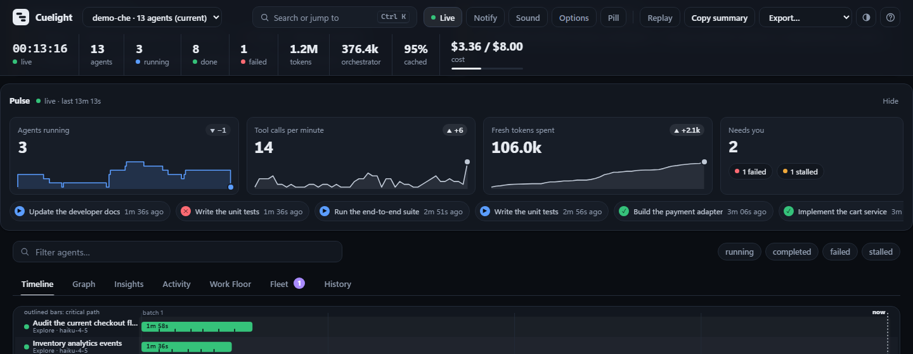

- **Agents** — a tab of its own, every agent on one row: what it was asked, what
  its brief said to deliver, and the start of what it reported back, side by side,
  with its status, whether it checked its work, its time, cost (or tokens) and
  failed calls. Rows that need a look say why (failed, stalled, waiting on you,
  checks failing, unchecked, no report, a possible loop, stuck retrying), and one
  button shows only those. Every column that holds a number or a state sorts; the
  filter bar applies; a row opens the agent's panel.

  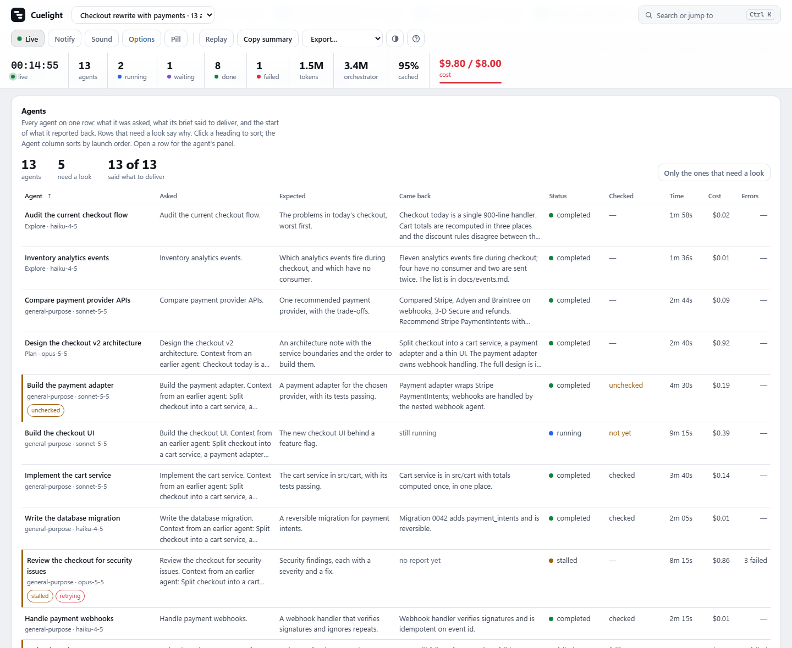

- **Insights** — the questions a run raises once it is over (or half over):
  how parallel it really was, **the critical path** (the chain of agents that set
  its length; speeding up anything else will not finish it sooner), which tools
  and files dominated, the prompt-cache hit rate and who used the most fresh tokens.
  A strip at the top says what each card found in a few words,
  worst first (red for something wrong, amber for worth a look), and each chip
  jumps to its card. Cards fold to their title and that line, and stay folded in
  this browser.

  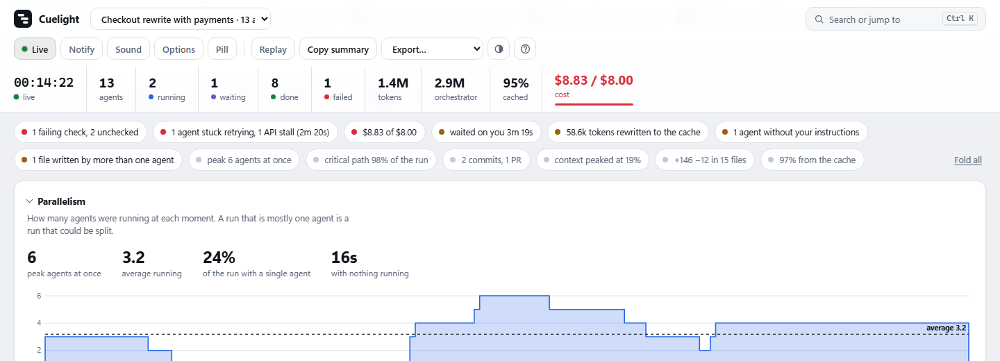

- **Spend** — a tab of its own: what the session cost as it ran, the main session
  and its agents stacked (or each model), with your budget line and where its
  warning and its limit were passed. Hover the chart, or focus it and use the
  arrow keys, to read the running total at any moment; the legend and a table
  under it carry every number too. Also: the pace now (last five minutes), when
  the budget runs out at that pace, the most expensive five minutes and who spent
  them, and the most expensive agents. Without a price file it counts fresh
  tokens instead of money.

  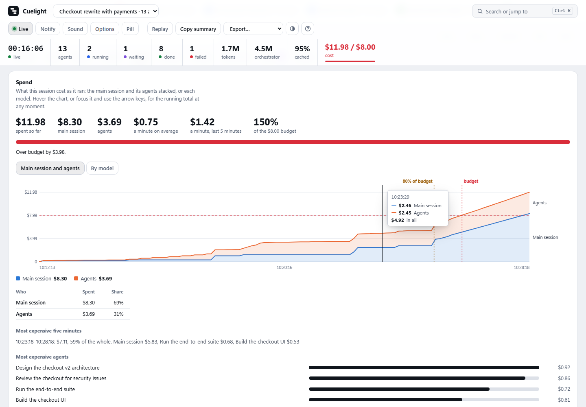
- **Did they check their work?** — for every agent that edited code: did it run a
  test, build, type check or lint (or the very file it edited) after its last edit,
  and did that pass? Finished agents with no check, or a failing one, go in the
  Health box with the evidence. "Unchecked" means no check was seen, not that the
  work is wrong. Docs and scratch files do not count. Add your own check commands
  with `ORCHESTRA_VERIFY_PATTERN`.

  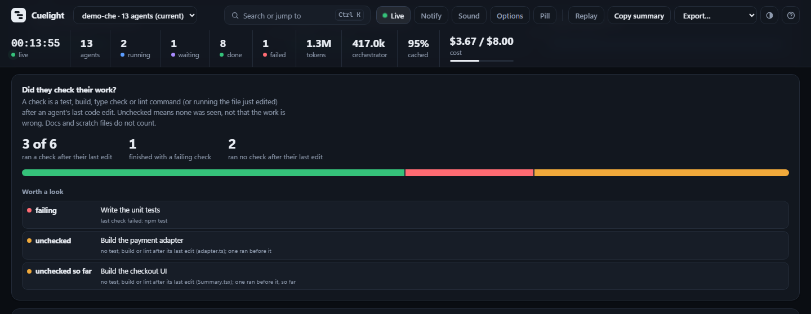

- **What each agent was told** — the CLAUDE.md, rules and memory files and the
  skills each agent had, and which agents ran without the project instructions the
  main session had. From what Claude Code records in every transcript, so it works on
  past sessions too; only paths, types and sizes are kept, never the content.

  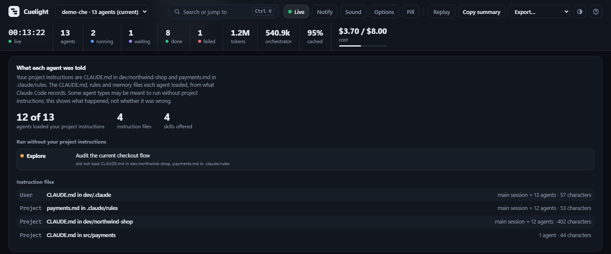

- **What the run produced** — commits, pushes, pull requests and test runs from the
  main session and every agent, with cost (or tokens) per commit and per pull request,
  pull requests as links and the latest commits with their message and author agent.
  Read from the git results Claude Code records, not guessed from command text.

  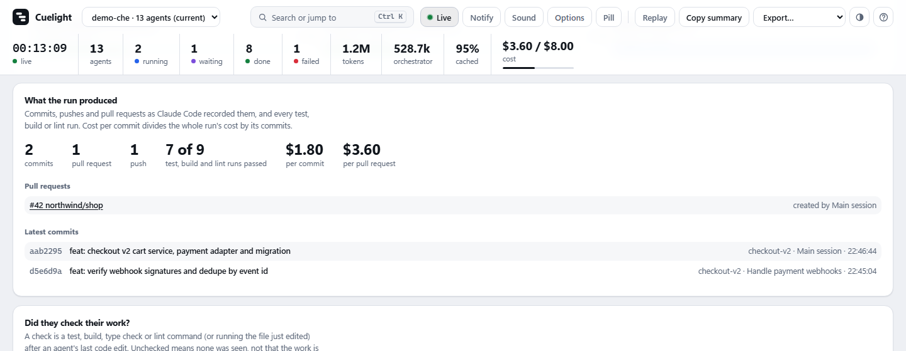

- **Prompts** — a tab of its own, one row per message you sent: when, what you
  asked, how long the work it started took (live while it runs), a bar
  splitting that time into waiting on you, agents and tools running, and Claude
  itself, and what it set off: agents launched, files edited, commits, and its
  cost (or tokens). The most expensive prompt and its share of the session lead
  the tab. Open a prompt for the whole of it, the time in words, the agents it
  launched (click one for its panel), the files it edited and its commits.
  Agents, files and commits count toward the prompt that was current when they
  started.

  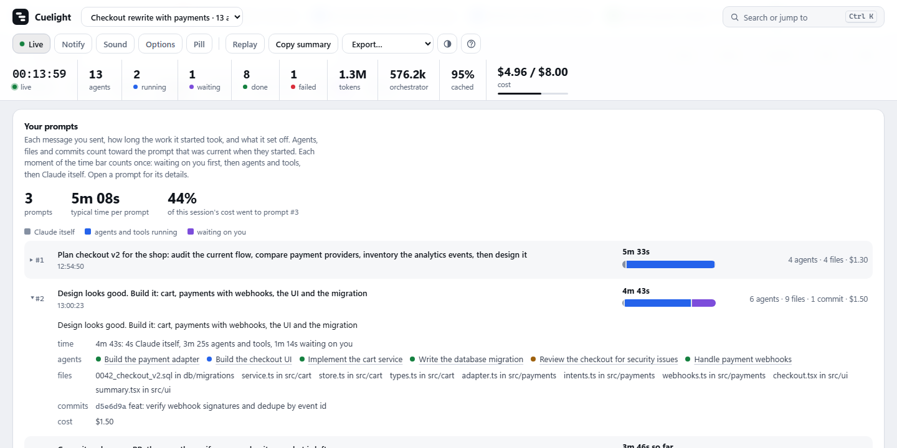

- **Where tokens were wasted** — every time the prompt cache was written again
  from scratch (after five minutes or an hour idle, a model switch or a
  compaction), for the main session and each agent: how many tokens, why, the
  permission prompt you were answering meanwhile, and what it cost above the
  cache-read price. Also the biggest tool results pulled into context (with how
  many later calls carried them) and re-reads of files that came back
  unchanged. On real sessions, rebuilds were a third of everything written to
  the cache.

  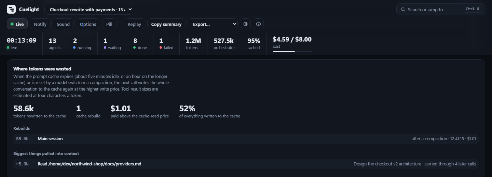

- **How full each context got** — the main session's context on every API call
  (everything the model was sent, cached or not), with a mark at each
  compaction and its size before and after, whether you ran `/compact` or Claude
  Code did, and how long it took; agents ranked by their fullest call; and a
  Health box item for the main session or a running agent past 80% of its
  window. Transcripts do not record a model's window, so it is assumed (1M, and
  200k for Haiku) and `ORCHESTRA_CONTEXT_LIMITS` changes it. On real sessions
  main contexts reached 885k and agents 235k.

  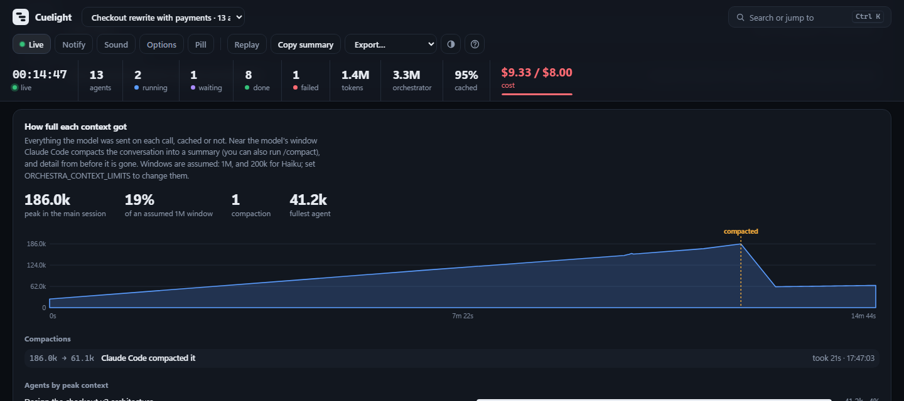

- **What went wrong** — every API error Claude Code recorded (usage or rate limits,
  failed logins, server errors), with how long until the API answered again (a burst
  of the same error before any reply counts as one stall); tool calls whose result was
  an error, by tool and by agent, each tool with its most common error; the same call
  tried again after failing and whether it worked (a command must match in full, a file
  edit only by file); and commands that ran past their timeout, which Claude Code now
  moves to the background. A running agent that fails its latest call three times in a
  row goes in the Health box as RETRYING. On real sessions most retries were the normal
  fix-and-rerun and worked (47 of 49); session limits cost about 18 hours across 13 stalls.

  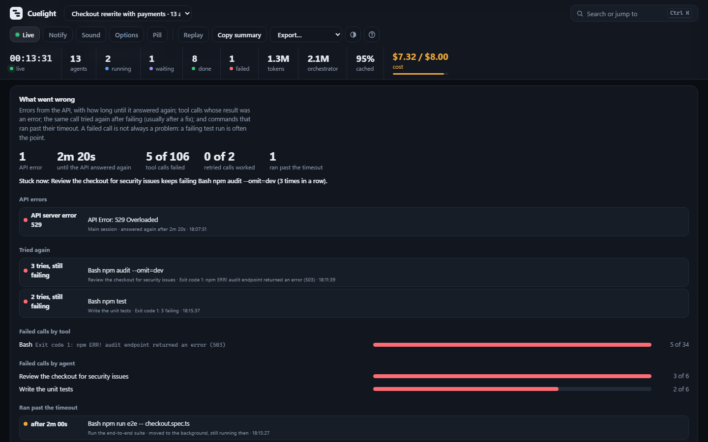

- **What changed** — each agent's file changes as real diffs (from the patches Claude
  Code records), folded per file in the agent panel with line numbers and the time of
  each edit, plus an Insights card with lines added and removed per agent and the most
  changed files. Redacted like everything else; scratch files are shown but not counted.

  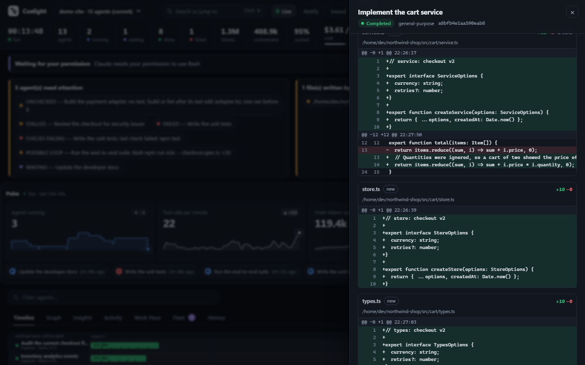

- **Waiting on you** — how long agents sat on permission and input prompts only
  you could answer: your time (overlapping waits counted once), agent time lost
  (every wait added), the longest wait, a per-agent ranking and the latest prompts.
  A wait still open counts up live. A wait ends when the agent moves again, so an
  approved command's own run time is included; a prompt left up when the session
  ended is shown as never answered, not given a made-up length.

  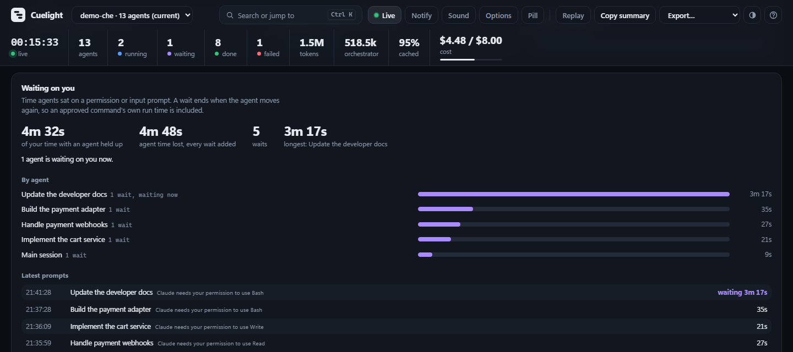

- **Search and shortcuts** — `Ctrl/Cmd+K` (or `/`) opens one box for agents,
  tool calls, files and commands. Number keys switch views; `L` pauses live
  updates, `R` replays, `T` changes the theme, `?` lists every shortcut. Shortcuts
  never fire while you are typing, or for a key the focused control uses itself
  (`0` fits the graph). Keyboard focus stays where it was when a live update
  redraws the view. Search matches the redacted text only.
- **Light, dark or automatic** — designed together, with text and status colours
  held to WCAG 4.5:1 by a test; follows reduced-motion; usable at phone width.

- **Timeline** — one row per agent: a status dot, a duration bar, parallel
  waves banded together. A still-running agent's dot pulses and its bar
  breathes, so "in progress" is never just a color you have to notice.
- **Graph** — who fed whom. Solid edges are exact (spawn, file handoff, direct
  message); dashed edges are inferred from text reuse and carry the snippet
  that produced them, so you can judge them yourself. The longest
  duration-weighted chain — the actual bottleneck, not just the longest hop
  count — is highlighted. Drag to pan, Ctrl/Cmd+wheel or the buttons to zoom,
  `0` to fit; hover an agent to fade everything unrelated to it. A newly-detected handoff flashes a dot
  traveling the edge the moment it happens.
- **Activity** — a merged, live, newest-first feed of tool calls across every
  running agent, click-through to the agent it came from. Its search box looks
  through every tool call the run made, finished agents included: by tool, file,
  command or agent, or only the calls that failed. Matches are marked, repeats of
  one call show as one row with a count and how many failed, and Enter steps
  through them (Shift+Enter back, Escape clears).

  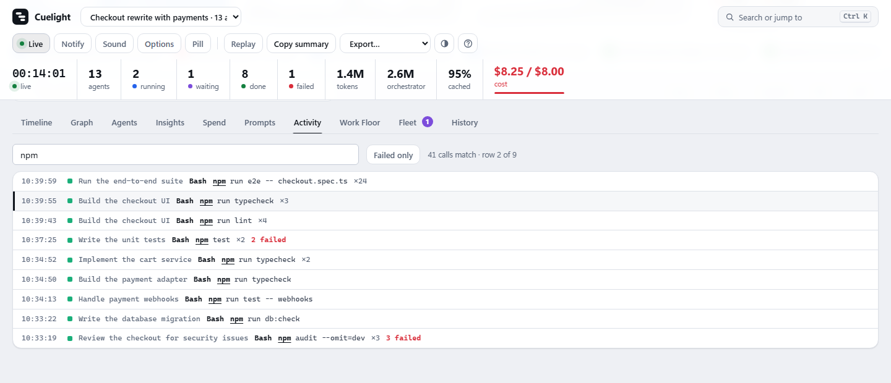
- **Work Floor** — every agent as a small pixel-art sprite, animated by its
  status (idle, running, waving on completion, a one-shot jump burst the
  moment it finishes), tinted a stable per-agent hue so a busy floor still
  reads as distinct agents at a glance. Each card also shows what the agent is
  doing right now (its last tool call) and where it has been busy; group the
  floor by role or by status, with the agents that need a look first.
- **Drawer** — each agent's brief, its extracted objective and expected
  output, its returned result, its exact model version, a cache-hit
  breakdown, a tool-mix fingerprint (Read/Edit/Bash/Task at a glance), every
  tool call, and the files it read and wrote.
- **Filter bar** — free-text search plus status chips; narrows every view
  (Timeline, Graph, Activity) at once without ever hiding or reflowing
  anything.
- **Health & write-conflict boxes** — stalled, failed, and orphaned agents
  surfaced instead of buried, plus a flag for any file two agents wrote
  independently — a real correctness risk, not just informational.
- **Replay** — scrub or play back the run (1×-120×) to see who had launched,
  who was running and who had finished at any moment. Works in a static report
  too, so a post-mortem needs no server. Statuses are reconstructed from start
  and end times; token totals are shown as unavailable, not as wrong numbers.
- **Possible loops** — a still-running agent that has repeated the same tool
  call several times (or strictly alternated between two) is listed with the
  evidence. Reported as *possible*: legitimate polling looks the same.
- **Deep links** — every view and agent has a URL (`#view=insights&agent=<id>`), pasteable into a PR
  or a Slack thread, that opens straight to its drawer.
- **Notifications** — an optional desktop alert when an agent fails, the
  session ends, or Claude is waiting on your permission, for when you're not
  watching the tab.
- **Fleet** — every session active in the last few hours, across all projects,
  most urgent first (blocked on a permission prompt or an API error), with a
  tab badge and an alert when a session you are *not* looking at needs you.
  Click one to jump to it.
- **Catch me up** — every session is named by its title (the one you gave it
  with `/rename`, else the one Claude Code generated), in the Fleet view, the
  session picker, the browser tab, alerts and reports. Under the title the
  Fleet shows what the session needs from you, else Claude Code's own "while
  you were away" recap with its age, else the last thing you asked. The recap
  of the session you are viewing sits under the header (click for all of it),
  and says so when the session has worked since it was written. Read from the
  records Claude Code already writes; nothing new is collected.

  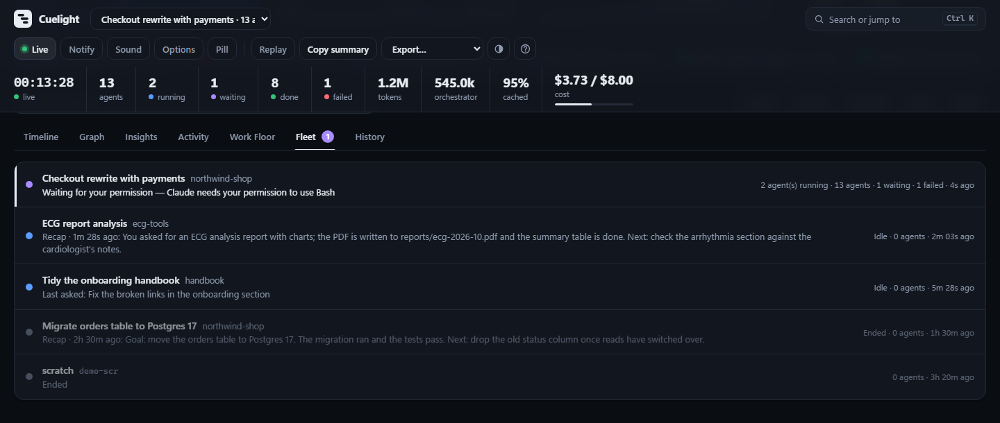
- **Pill** — a small always-on-top window (Chrome/Edge: click *Pill*) showing
  what needs you across all sessions, with a dot per agent. Every browser also
  gets a `(2) Cuelight` tab title (with the session's title in front when it has one) and a
  colored, counted favicon.
- **Sounds** — optional (click *Sound*). Three synthesized tones: needs you,
  something failed, all done. History never makes noise; at most one sound per
  update. No audio files, so nothing is fetched. *Options* mutes any one of the
  three and sets quiet hours (which silence all of them, failures included);
  both are remembered in this browser only.
- **Live** — updates arrive the moment a transcript or hook event changes
  (Server-Sent Events), not on a timer; polling is only a safety net.
- **Attention banner** — what the session is blocked on right now: a permission
  prompt, your input, or an API error such as `rate_limit`.
- **Copy summary** — one click produces a paste-ready markdown summary for a
  PR description or a status update.

## Live events (hooks)

Installing the plugin also registers small **async** Claude Code hooks for seven
events: session start/end, subagent start/stop, notifications, API failures and
turn end. They are what let Cuelight say an agent is *waiting for your
permission*, or that it died to a rate limit — facts a transcript cannot show.

- Each hook records one line to `<state dir>/events/<session>.jsonl` and exits.
  It never blocks or fails Claude Code (async, always exit 0, silent), and costs
  one short Python start (about 50 ms on Linux, about 0.2 s on Windows) off Claude's
  critical path.
- Only the event name, session/agent ids, working directory, and a short
  redacted message are stored. **Tool inputs, prompts, and file contents are
  never recorded.** Per-tool events (`PreToolUse`/`PostToolUse`) are not hooked.
- The state directory is per-user, mode `0700`, never under `~/.claude`; spool
  files are deleted after 7 days.
- Turn recording off entirely with `ORCHESTRA_EVENTS=off` in the environment
  Claude Code runs in. The dashboard then works from transcripts alone.

## Cost and budget

Cuelight shows what a run cost **only if you give it prices** — prices change
and differ by contract, so none are built in. Copy
[`docs/prices.example.json`](docs/prices.example.json) to
`~/.config/cuelight/prices.json` (Windows: `%APPDATA%\cuelight\prices.json`, or
point `ORCHESTRA_PRICES` at any file), replace the illustrative numbers with
yours, and the header gains a cost figure. The file is re-read when it changes.

- Cost covers the **orchestrator's own usage as well as every subagent's**, per
  model (a session can switch models). A model with no matching price is listed
  as unpriced and the total is marked *partial* rather than silently counting it
  as free.
- Set `ORCHESTRA_BUDGET` (in the price file's currency) to get a warning at 80 %
  of it and an alert when it is passed.

## Run history (opt-in)

Set `ORCHESTRA_HISTORY=on` to remember how past runs went and compare them
(agents, failures, wall time, tokens, cost, loops) in the **History** tab.

This is the one feature that keeps data after a session is gone, so it is off by
default and stores the least that answers the question: **metrics only** —
counts, durations, tokens, cost, and the project directory. No prompts, briefs,
results, task descriptions, or file paths. It lives in
`~/.local/share/cuelight/history.sqlite` (Windows: `%LOCALAPPDATA%\cuelight`),
mode `0600`, is pruned after 90 days / 500 runs, and deleting that file erases
it. A database problem never breaks the dashboard.

## Privacy

Cuelight is local, and does not control Claude Code: it only observes. The full policy is in
[PRIVACY.md](PRIVACY.md).

- The server binds `127.0.0.1` only, and every API call requires a token minted
  at launch.
- There is no network egress of any kind: no CDN, no fonts, no telemetry. Every
  asset ships in the package.
- It never writes to any file under `~/.claude`.
- Anything that looks like a credential is redacted before it reaches the page.

## Configuration

Every threshold has a default and can be overridden with an environment
variable, read at startup. A missing, non-numeric, or out-of-range value is
ignored in favour of the default.

| Variable | Default | Meaning |
|---|---|---|
| `ORCHESTRA_STALL_SECONDS` | 300 | An agent with an open round and no activity this long reads as `stalled` |
| `ORCHESTRA_SESSION_LIVE_SECONDS` | 600 | A session whose transcript was touched this recently counts as live |
| `ORCHESTRA_HUB_FILE_THRESHOLD` | 3 | A file read by more agents than this, written by none, is shared context |
| `ORCHESTRA_HANDOFF_CONTAINMENT` | 0.15 | Text-reuse score (0-1) at which a handoff edge is inferred |
| `ORCHESTRA_HANDOFF_RUN_WORDS` | 40 | A shared run this many words long also infers a handoff |
| `ORCHESTRA_SHINGLE_SIZE` | 8 | Words per shingle in handoff scoring |
| `ORCHESTRA_IDLE_SHUTDOWN_SECONDS` | 1800 | The server exits after this long with no request |
| `ORCHESTRA_PORT` | 7717 | First port tried (it walks upward if taken) |
| `ORCHESTRA_MAX_BUILDERS` | 24 | Sessions kept in memory at once |
| `ORCHESTRA_FLEET_SECONDS` | 21600 | The Fleet view lists sessions active within this window |
| `ORCHESTRA_FLEET_MAX_SESSIONS` | 50 | Most sessions the Fleet view lists |
| `ORCHESTRA_PRICES` | `~/.config/cuelight/prices.json` | Price table that enables cost (see above) |
| `ORCHESTRA_BUDGET` | 0 (off) | Per-session spend limit, in the price file's currency |
| `ORCHESTRA_BUDGET_WARN_RATIO` | 0.8 | Fraction of the budget at which warnings start |
| `ORCHESTRA_LOOP_REPEATS` | 6 | An open agent whose last N tool calls are identical is flagged as a possible loop |
| `ORCHESTRA_LOOP_CYCLE_CALLS` | 16 | ...or whose last N calls strictly alternate between two distinct calls |
| `ORCHESTRA_CONTEXT_LIMITS` | 1M, Haiku 200k | Assumed context windows, as `part-of-model-name=tokens` pairs (e.g. `haiku=200000,opus=1000000`); a context past 80% of its window goes in the Health box |
| `ORCHESTRA_VERIFY_PATTERN` | none | Extra commands that count as checking work, as a regular expression (e.g. `\bsmoke\.sh\b`); an invalid one is ignored and the Insights card says so |
| `ORCHESTRA_HISTORY` | off | `on` records run metrics for the History tab |
| `ORCHESTRA_HISTORY_DB` | `~/.local/share/cuelight/history.sqlite` | Where history is kept |
| `ORCHESTRA_HISTORY_DAYS` | 90 | Runs older than this are deleted |
| `ORCHESTRA_HISTORY_MAX_RUNS` | 500 | Most runs kept |
| `ORCHESTRA_STATE_DIR` | per-user dir in the OS temp dir | Where port files, logs and the event spool live |
| `ORCHESTRA_EVENTS` | on | `off` stops the hooks recording anything |

## What Cuelight runs and touches

Everything it does, in one place (the full policy is in [PRIVACY.md](PRIVACY.md), the threat model in
[SECURITY.md](SECURITY.md)):

| | |
|---|---|
| **Programs it runs** | `bin/cuelight`, a short shell script that starts `orchestra/__main__.py` with your Python (the dashboard, started only when you run `/cuelight:open`; Claude Code asks you before it runs, since the command pre-approves nothing, and "don't ask again" covers only `cuelight`) and `orchestra/hook.py` (one short-lived process per Claude Code event, installed by `hooks/hooks.json`). Both are plain Python from this repository; nothing is downloaded or installed. |
| **Files it reads** | Claude Code transcripts under `~/.claude/projects`, its own hook spool, and an optional price file you provide |
| **Files it writes** | The hook spool and a port/token file in a per-user state folder (deleted after 7 days or when the dashboard stops) plus the dashboard's error log there (normally empty), an optional metrics-only history file (off by default), and an HTML report or CSV/JSON export only when you ask for one. Never anything under `~/.claude` |
| **Network** | None. The server listens on `127.0.0.1` only and nothing is fetched or sent. Using Claude Code itself is unchanged |
| **Permissions it needs** | None beyond running the two programs above. It is read-only and cannot approve, deny or change anything in Claude Code |
| **Works in** | Claude Code (terminal, IDE extensions and the desktop Code tab). It needs a local Python 3.9+ and does not run on claude.ai chat or Cowork |

## Development

```bash
python -m unittest discover -s tests -t . -v
```

Standard library only, tests included. Node 22+ runs the tests that render the page; without it they skip
themselves. `claude plugin validate --strict .claude-plugin/plugin.json` checks the plugin the way CI does.
Before you push, read [CONTRIBUTING.md](CONTRIBUTING.md): Anthropic's plugin directory scans every file,
tests and docs included, and rejects credential-shaped text even when it is fake.

## How it works

For the whole flow on one page see [`docs/WORKFLOW.md`](docs/WORKFLOW.md). To contribute, see
[`CONTRIBUTING.md`](CONTRIBUTING.md).

For the full architecture — how transcripts are turned into a dashboard, the
exact formulas behind the status states and the graph's edges, and what every
feature shows and why — see [`docs/ARCHITECTURE.md`](docs/ARCHITECTURE.md).
