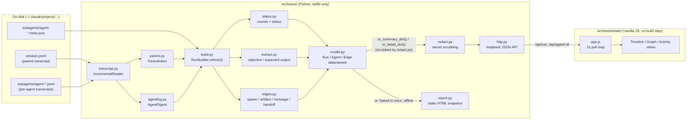

# Orchestra — Architecture & Feature Reference

This document explains how Orchestra works end to end: what problem it solves,
how the pieces fit together, the exact formulas and heuristics it uses to turn
raw transcript files into a dashboard, and what every feature on screen does
and why it exists. It assumes no prior knowledge of the codebase.

If you just want to *use* Orchestra, see [`README.md`](../README.md). This
document is for understanding — or extending — how it's built.

> **A note on the demo data.** Orchestra was itself built by a 22-agent Claude
> Code orchestration, following the 16-task plan in
> [`docs/superpowers/plans/2026-09-12-orchestra.md`](superpowers/plans/2026-09-12-orchestra.md).
> That build's own transcript (session `73b33781`) is what most of the
> screenshots and examples in this document — and in the dashboard's own
> development — are drawn from. Later features were validated the same way,
> one level further in: pointing a live Orchestra server at *its own
> currently-running development session* and dispatching real subagents to
> watch. That's exactly how the notification-parsing fix and the fork
> self-parent fix (both in §5) were found — not in a test, but by watching
> the dashboard lie about its own live agents in real time. Orchestra
> watches its own construction, live.

---

## 1. What problem this solves

When Claude Code runs subagents (via the `Task`/`Agent` tool), the only
record of what happened is scattered across several files:

- the **main session transcript** (`~/.claude/projects/<project>/<session>.jsonl`),
  which contains the *launch* of each subagent and the *result* it returned
- a **per-agent transcript** (`.../<session>/subagents/agent-<id>.jsonl`),
  which is that subagent's own turn-by-turn record — its tool calls, its
  token usage, its final message
- a **per-agent metadata file** (`agent-<id>.meta.json`) with a few fields
  the launch/result records don't carry (agent type, spawn depth, model)

None of this is a dashboard. There's no single place that says "22 agents
ran, here's who fed whom, here's who's stuck, here's what each one actually
did." Orchestra reads exactly these files — nothing else, no instrumentation,
no changes to how Claude Code runs — and reconstructs that picture.

It is deliberately **read-only** and **local-only**: it never writes under
`~/.claude`, never talks to the network, and only serves `127.0.0.1`.

---

## 2. How you run it — the `/orchestra` slash command

Orchestra ships as an installable Claude Code **plugin**
(`.claude-plugin/plugin.json` + `.claude-plugin/marketplace.json`), installed
with:

```
/plugin marketplace add <this repo>
/plugin install orchestra
```

That makes the `/orchestra` command (defined in
[`commands/orchestra.md`](../commands/orchestra.md)) available. It's a thin
dispatcher — the actual work is a plain Python CLI
([`orchestra/__main__.py`](../orchestra/__main__.py)) that the command shells
out to:

| You type | The command runs | What happens |
|---|---|---|
| `/orchestra` | `python -m orchestra --session $CLAUDE_CODE_SESSION_ID` | Starts the dashboard server (if not already running for this session) and opens the URL |
| `/orchestra stop` | `python -m orchestra --session ... --stop` | Kills the server process for this session |
| `/orchestra report` | `python -m orchestra --session ... --report .` | Writes one self-contained `.html` file — no server needed to view it |

### What `--session` actually does under the hood

1. **Port file reuse.** Each session gets a small JSON file in the OS temp
   directory (`orchestra_<session-id>.json`) recording the port, an
   auth token, and the server's PID. If that file exists and the server
   answers `/api/health`, the running server is reused instead of starting a
   second one.
2. **Detached launch.** Otherwise, `cmd_start` spawns
   `python -m orchestra --serve --session <id>` as a **detached background
   process** (on Windows: `DETACHED_PROCESS | CREATE_NEW_PROCESS_GROUP`; on
   POSIX: a new session) so the dashboard keeps running after the command
   that launched it returns, and polls the port file for up to 5 seconds
   waiting for it to come alive.
3. **Idle shutdown.** A background watchdog thread checks every 30 seconds
   whether the server has been silent for `IDLE_SHUTDOWN_S` (30 minutes) and
   shuts itself down — so a forgotten dashboard doesn't run forever.
4. **The URL.** `http://127.0.0.1:<port>/?k=<token>&session=<id>` — the token
   is required on every API call (see [§8 Security](#8-security--privacy-model)).

---

## 3. The core idea: reconstructing orchestration from transcripts alone

To read the rest of this document, it helps to know the vocabulary Claude
Code's own transcripts use — Orchestra's whole backend is built around
recognizing these patterns in the JSONL:

| Concept | What it looks like in the transcript | What Orchestra calls it |
|---|---|---|
| Spawning a subagent | A `tool_use` block named `Task` or `Agent` in the **parent's** transcript | a **launch** (`LaunchRecord`) |
| A subagent finishing inline | The matching `tool_result` block, same turn | a **result** (`ResultRecord`) |
| A subagent finishing in the background | The `tool_result` text contains `"Async agent launched"` and an `agentId: <hex>` | a **background launch mode** |
| A background agent's completion signal | A `<task-notification>` block appearing later in the parent's transcript | a **notification** |
| Waking a *finished* agent back up | `SendMessage` targeting a known agent id | a **resumed round** — the agent gets a second `Round` |
| Several agents launched in the same assistant turn | Same `uuid` on the parent message | a **batch** — a parallel "wave," shown as a shaded band in the Timeline |
| A subagent launching its own subagents | `isSidechain: true` entries with an `agentId` | **nested orchestration** — tracked via `parent_agent_id` / `spawn_depth` |

An agent's full lifecycle can therefore span **multiple `Round`s** (an initial
run, then zero or more resumptions via `SendMessage`), which is why the data
model has `Agent.rounds: List[Round]` rather than a single start/end pair.

---

## 4. Architecture: how a byte on disk becomes a pixel on screen



Two ways to view the data, one code path underneath:

- **Live server** ([`http.py`](../orchestra/http.py)): the browser polls
  `GET /api/run` every 2 seconds; `app.js` re-renders whichever tab is open.
- **Static report** ([`report.py`](../orchestra/report.py)): the *same*
  `app.js` and `style.css` are embedded verbatim into one HTML file, along
  with the run data baked in as `window.ORCHESTRA_RUN`/`ORCHESTRA_DETAILS`.
  A tiny shim replaces the network `api()` function with one that reads
  those baked-in objects instead, and turns polling off (`state.live =
  false`). This is why a bug fixed in one view is fixed in both — there is
  only one frontend, ever.

### `RunBuilder.refresh()` — the one function that decides everything shown

Every poll (or report generation) calls `RunBuilder.refresh()`
([`build.py`](../orchestra/build.py)), which:

1. Reads only the **newly appended bytes** of every relevant `.jsonl` since
   last time (`IncrementalReader` — see §5's `transcript.py` entry below).
2. Folds new parent-transcript entries into `ParentIndex` (launches, results,
   notifications) and new per-agent entries into that agent's `AgentDigest`
   (tokens, tool calls, files touched).
3. Determines the full set of agent ids that have ever existed
   (`_agent_ids`), builds each one's `Round` history and `status`
   (`status.py`), extracts its objective/expected-output from its brief
   (`extract.py`), and assembles an `Agent` dataclass. One guard worth
   knowing about here: a **fork**-type agent's own transcript replays its
   full inherited history — including the very entry that launched it,
   tagged (like every entry in that agent's own transcript file) with
   `isSidechain: true` and that agent's own id. Read naively, that looks
   like the agent spawning itself. `_assemble` refuses to let an agent
   become its own `parent_agent_id`, since that can never legitimately
   happen — without the guard, a forked agent shows a self-loop spawn edge
   in the Graph instead of `main → agent`.
4. Infers `Edge`s and file relationships across the *whole* agent set
   (`edges.py`) — this has to happen after every agent is assembled because
   an edge is a relationship *between* two agents.
5. Groups agents into `Batch`es by the assistant-turn `uuid` that launched
   them (parallel waves).
6. Returns one immutable `Run` dataclass. `Run.to_summary_dict()` (light,
   polled every 2s) and `Agent.to_detail_dict()` (heavier, fetched only when
   a drawer opens) both run every string through `redact.py` before they
   leave the process.

This whole method holds a lock (`self._lock`) for its duration — the HTTP
server is multi-threaded, and `IncrementalReader`'s byte offsets and each
`AgentDigest`'s accumulating counts would double-count if two requests
refreshed the same builder concurrently.

---

## 5. Backend module reference

### `locate.py` — finding sessions on disk
The only module that knows Claude Code's on-disk layout
(`~/.claude/projects/<encoded-project-path>/<session-id>.jsonl`, honoring
`CLAUDE_CONFIG_DIR`). `find_session` locates one session by id across *every*
project directory (an id search, not a path guess), so passing a bare session
id always works regardless of which project it belongs to.

### `transcript.py` — incremental reading
`IncrementalReader` remembers, per file, the byte offset already consumed.
Because Claude Code appends to these files *while Orchestra is reading them*,
a partially-written final line is the normal case, not an error: the reader
finds the last `\n` in the chunk it read and only advances its offset past
that point, leaving a torn tail for the next poll to pick up whole. A file
that shrinks (truncated or replaced) resets the offset to 0 rather than
seeking into garbage.

### `parent.py` — the parent transcript's shapes
Deliberately isolated from `build.py` because this is the part most likely to
change between Claude Code versions: it defines `LaunchRecord`,
`ResultRecord`, and `Notification`, and every accessor here tolerates missing
or unexpected fields — a format change degrades the view instead of crashing
the server. Also home to `parse_timestamp`, which turns Claude Code's
ISO-8601 (`...Z`) timestamps into POSIX floats — every duration and every
x-axis position in the UI ultimately traces back to this one function.

That "most likely to change" warning turned out to be exactly right: running
Orchestra against a genuinely live session surfaced a build that delivers a
background agent's `<task-notification>` wrapped in a top-level
`queue-operation` entry (`operation: "enqueue"`) or an `attachment` entry,
neither of which has a `message` field at all. `_notification_text` now
checks both shapes (skipping a queue `"remove"`, which is the same
notification being dequeued, not a second one) before falling back to the
original message-based lookup. Without this, every background agent in such
a session eventually reads as `stalled` no matter how long ago it actually
finished — the completion text was sitting in the file the whole time,
just not where the parser was looking.

### `agentlog.py` — digesting a subagent's own transcript
`AgentDigest` accumulates, per agent: token usage split by type (`input`,
`output`, `cache_read`, `cache_create` — this split is what powers the
cache-hit feature, see the "Header totals" entry in §7), every tool call
(name + a short "target" string extracted from that tool's most relevant
argument — e.g. `file_path` for `Read`, `command` for `Bash`), and the file
paths read/written. It also tracks `ended_mid_tool`: whether the transcript's
last entry was a tool call with no matching result, which the status state
machine (below) uses to tell "process died while doing something" apart from
"process just went away."

It also records `model` — the real, versioned model the agent's own
transcript reports (`"claude-sonnet-5"`), which is the ground truth over the
short alias requested at spawn time (`"sonnet"`, carried in `meta.json`);
`build.py` prefers this field whenever it's present (see below). One
wrinkle: Claude Code injects a synthetic wrap-up message on an interrupted
or errored turn with `model` literally set to the string `"<synthetic>"` —
`AgentDigest` ignores that value rather than letting it clobber the last
genuine model the agent actually ran on.

### `status.py` — the agent lifecycle state machine
Two functions, and this is the "formula" behind every colored dot in the UI:

**`build_rounds`** turns a launch + result + notification list into a
`List[Round]`:
- If there are `Notification`s (background-agent completions), one `Round`
  per notification, chained start-to-next-start; if activity was seen *after*
  the last notification, an extra open `Round` is appended — the agent was
  resumed via `SendMessage`.
- Otherwise, an inline result with a timestamp closes a single `Round`
  immediately.
- Otherwise, one open `Round` (still running), or none at all if there's no
  evidence the agent ever started.

**`compute_status`** — precedence, in order:
1. No rounds at all → `unknown`.
2. The last round already has an end → that round's own status
   (`completed`/`failed`) wins, full stop.
3. Otherwise the round is still open. If the **session itself** is no longer
   live (see below), the agent is `failed` if it died mid-tool-call
   (`ended_mid_tool`), else `orphaned` — dying while holding a tool call is
   *positive evidence* of failure; the session simply ending is not.
4. If the session is live but nothing has happened for more than
   `STALL_THRESHOLD_S` (**300 seconds**), the agent is `stalled`.
5. Otherwise, `running`.

A **session** itself counts as "live" (`RunBuilder._session_live`) if its
main transcript file was modified within `SESSION_LIVE_THRESHOLD_S`
(**600 seconds**) of now — this is a mtime check, nothing fancier, which is
exactly why a truly finished session (report generation) never counts as
live.

### `extract.py` — pulling intent out of free text, deterministically
Every subagent's `objective` and `expected_output` fields (shown in the
drawer) are extracted from its raw prompt with **zero LLM calls** — same
input always produces the same output, offline, free. The heuristic, in
priority order:
1. Look for a markdown heading matching a known vocabulary (`## Objective`,
   `## Expected output`, `## Deliverable`, `## Report Contract`, …) and take
   the body under it, stopping at the next heading of equal-or-shallower
   depth.
2. Failing that, look for the first line starting with a recognized
   imperative (`"You are..."`, `"Return..."`, `"Report..."`), plus up to two
   following lines.
3. Failing that, fall back to the agent's `description` field plus the
   brief's first paragraph — and if that fallback text for "expected output"
   turns out to be identical to the objective's fallback text, report
   `"not stated"` rather than showing the same paragraph twice under two
   different headings.

Every extraction is tagged with **where it came from** (`objective_source`,
e.g. `heading "Objective"` or `fallback`) — shown in the drawer as a small
italic caption — so a reader can judge how much to trust it.

### `edges.py` — the four ways one agent's work becomes another's input
This is the graph's evidence engine. All four kinds run over the *whole*
assembled agent list:

| Kind | Confidence | How it's found |
|---|---|---|
| **spawn** | exact | Every agent has exactly one: `parent_agent_id or "main"` → itself. Comes straight from the launch record. |
| **artifact** | exact | Agent A writes path P (via `Write`/`Edit`/`NotebookEdit`) at time *t₁*; Agent B reads P (via `Read`) at time *t₂* > *t₁*. One edge per (writer, reader) pair per file, carrying the write/read timestamps as evidence. Paths are normalized first (backslash→slash, lowercased, and a worktree path like `...\.claude\worktrees\wt\src\a.py` is collapsed onto `...\src\a.py`) so the same file is recognized across worktrees. |
| **message** | exact | A `SendMessage` tool call whose target is a known agent id. |
| **handoff** | **inferred** | No write/read or message connects A and B, but B's *brief* substantially reuses words from A's *result*. See the formula below. |

**Hub files.** A path read by more than `HUB_FILE_THRESHOLD` (**3**) agents
but written by none of them isn't a dependency — it's shared context (a plan
file, a spec) — so it's collapsed out of the graph entirely and listed
separately as a "shared context" note instead of drawn as a fan of edges.

**Write conflicts** (added after the initial build, alongside `hub_files`):
the same write-tracking map, read the other way — if **more than one agent**
wrote the same path, that's surfaced as a correctness flag, not a
dependency. See the "Write-conflict box" entry in §7.

**The handoff heuristic, precisely.** For candidate pair (A→B) where B
started after A ended: split both texts into lowercase words, take all
overlapping windows of `SHINGLE_SIZE` (**8**) consecutive words (a
"shingle") from each, and compute

```
containment = |shingles(A.result) ∩ shingles(B.brief)| / |shingles(A.result)|
```

plus the length of the single longest contiguous word run the two texts
share (`difflib.SequenceMatcher.find_longest_match`). The edge is drawn only
if `containment ≥ HANDOFF_CONTAINMENT` (**0.15**) **or** the longest run is
≥ `HANDOFF_RUN_WORDS` (**40**) words — and if an *exact* edge already
connects the same pair, the handoff evidence is folded into it instead of
drawn separately (so a pair never has to be second-guessed twice). Every
handoff edge ships its score and the matching snippet as evidence, shown
when you click the edge — the dashed line is a claim you're meant to be able
to check, not a fact.

### `redact.py` — the one chokepoint everything passes through
`scrub()`/`scrub_obj()` run on every string right before it's serialized —
never earlier, so a credential can't be half-stripped by an intermediate
truncation and survive the other half. It matches, in order (more specific
patterns first, so a generic one can't eat a more specific one's prefix):
private-key PEM blocks, JWTs, Anthropic/OpenAI/GitHub API key shapes, AWS
access-key ids, `Bearer <token>` headers, and `key = value` /
`key: "value"` assignments where the key name looks credential-shaped
(`password`, `secret`, `api_key`, `access_token`, …) — replacing only the
*value*, so `api_key=<redacted:secret>` stays readable as a shape without
leaking the content.

### `model.py` — the shapes everything else builds
Plain dataclasses, no behavior beyond a few computed properties
(`Agent.duration_s`, etc.) and two serialization methods per class:

- **`to_light_dict()`** — what the 2-second poll loop sends: enough for the
  Timeline and Graph (status, timing, token totals, a capped 200-character
  objective), nothing large (no full tool-call list, no full brief).
- **`to_detail_dict()`** — what a drawer fetch gets: everything, uncapped —
  full brief, full result, the complete tool-call list, every file path.

This light/heavy split is why opening a drawer makes a *second* network
request rather than the summary already containing everything.

### `http.py` — the server
A `ThreadingHTTPServer` bound to `127.0.0.1` only. See
[§8](#8-security--privacy-model) for the full security model. Three JSON
routes (`/api/run`, `/api/agent/<id>`, `/api/sessions`) plus static file
serving for the dashboard's own HTML/JS/CSS, with a `realpath`-based
containment check so a symlink planted under `static/` can't be used to read
files outside it.

### `report.py` — the static snapshot
Renders one self-contained `.html` file: the same page shell, the same
`style.css`, and `app.js` with a small string-replacement shim
(`_offline_shim`) that swaps its `api()` function for one reading
`window.ORCHESTRA_RUN`/`ORCHESTRA_DETAILS` (baked into the page as JSON) and
turns polling off. Every literal opening-angle-bracket in the JSON payload is
escaped to its six-character Unicode form (backslash, `u`, `0`, `0`, `3`,
`c`) before embedding, so a brief or result containing a literal closing
script tag can't break out of the inline `<script>` tag it's embedded in.

### `__main__.py` — the CLI
`start` / `stop` / `report` / the hidden `--serve` (what the detached child
process actually runs). Covered in [§2](#2-how-you-run-it--the-orchestra-slash-command).

---

## 6. Frontend architecture (`orchestra/static/`)

No build step, no framework, no dependency — one `app.js`, one `style.css`,
one `index.html`, plain `fetch`/DOM/SVG APIs. The whole file is organized
around one `state` object and one `render()` dispatcher:

```js
state = {
  run,                 // the last /api/run payload
  view,                 // "timeline" | "graph" | "activity"
  filterText, filterStatuses,   // the filter bar's current selection
  toolCache, ticker,    // the Activity tab's accumulated feed
  seenEdgeKeys, graphSeeded,     // which graph edges have already been drawn
  notifyEnabled, notifySeeded, knownFailedIds, lastSessionLive,  // desktop alerts
  generation,           // see below
  ...
}
```

**The polling loop** (`poll()`) fetches `/api/run` every `POLL_MS`
(2000ms) and calls `render()`, which re-renders the header, health box,
conflicts box, filter chips, and whichever of the three views is active.
Every loop iteration is tagged with a **generation number**
(`state.generation`); toggling "Live" off/on or switching sessions bumps it,
and any in-flight response whose generation has gone stale is discarded
instead of overwriting a newer view — without this, two poll loops (an old
one winding down, a new one starting) could race and flicker between two
sessions' data.

**Text fitting.** SVG has no `text-overflow: ellipsis`. `fitText()` measures
real pixel width with an offscreen `<canvas>` 2D context
(`context.measureText`) and binary-searches for the longest prefix (plus an
ellipsis) that fits — never truncating by character count, which lies the
moment a label mixes wide and narrow glyphs. (It falls back to a rough
per-character estimate if no canvas context is available at all — the
project's own headless-Node render-check harness is one such environment —
so a constrained context degrades gracefully instead of throwing.)

**Motion.** The drawer is a real modal, not a page that happens to have a
panel on it: opening it shows a dimmed, blurred backdrop (`.scrim`) behind a
`transform: translateX` slide-in, and clicking the backdrop closes it exactly
like Escape does. A running agent's status dot/node border pulses with a
CSS `ping-ring` animation, and its open-ended bar breathes, so "in progress"
reads as motion, not just a color you have to notice. Every one of these is
guarded by `@media (prefers-reduced-motion: reduce)`.

**The three views** (`renderTimeline`, `renderGraph`, `renderTicker`) are
detailed feature-by-feature in the next section.

---

## 7. Every feature, what it shows, and why it exists

### Header totals + cache-hit readout
Agent counts, total tokens, wall time, and:

```
cache_hit_ratio = cache_read / (input + cache_read + cache_create)
```

— the fraction of *context* tokens (output is never cacheable, so it's
excluded from the denominator) that were served from Anthropic's prompt
cache rather than paid for fresh. Shown session-wide in the header and
per-agent in the drawer (with the full input/cache-read/cache-write/output
breakdown). **Why it matters:** it's the single number that tells you
whether your prompt-caching setup is actually working on a multi-agent run —
previously invisible, even though the data was already being collected.

### Health box
Lists every agent whose status is `stalled`, `failed`, or `orphaned` —
click one to jump straight to its drawer. The dashboard's answer to "did
anything go wrong," without scanning 20+ rows to find out.

### Write-conflict box
Lists every file path written by **more than one** agent, and by which
agents. Unlike a hub file (read by many, written by none — informational),
a write conflict is a real correctness risk: two agents independently
editing the same file is exactly how a merge silently loses one side's
change. In the demo session, this genuinely catches later "fix" batches
touching files an earlier batch already wrote — which is expected in an
iterative build, but exactly the kind of overlap you'd want flagged if it
weren't.

### Filter bar
A pill-shaped search box (inline icon, a focus glow instead of the default
outline, a clear button) matching description, agent id, type, model, and
the capped objective, plus status chips built dynamically from whatever
statuses are actually present in the current run (no point showing an
"orphaned" chip when nothing is orphaned). A live "N of M shown" counter
appears next to the box the moment a filter actually narrows something, and
disappears at rest rather than duplicating the header's own agent count.
Filtering **dims** non-matches rather than removing them — in the Timeline,
dimmed rows keep their slot so the layout never jumps; in the Graph, dimmed
nodes stay in place so edges never have to be recomputed around a missing
node. The same filter state is honored by the Activity ticker too, so "show
me only what agent X did" works everywhere.

### Timeline
One row per agent: a status-colored dot, its description and
type/model, and a duration bar positioned on a shared time axis (with
gridlines every quarter of the session's wall-clock span). Batch bands
(translucent, labeled "batch 1", "batch 2", …) shade the rows launched in
the same assistant turn, so a wave of parallel work reads as one visual
block instead of N separate rows that happen to overlap. Rows alternate a
faint background tint (zebra striping) purely so your eye doesn't lose the
row on a wide screen, and hovering a row highlights its full-width band —
important because a short-duration agent's bar can be only a few pixels
wide, far too small a target to hover reliably on its own. A `running`
agent's dot pulses with a ping ring and its still-open bar breathes — a
plain blue dot doesn't read as "actively happening" the way motion does.

### Graph
One node per agent (plus a synthetic "orchestrator" root), laid out
left-to-right by dependency rank (computed as **longest path over exact
edges only** — an inferred handoff edge is never allowed to move a node,
so a bad guess can't rearrange the whole picture) and top-to-bottom by a
two-pass barycenter sweep (minimizing edge crossings, the same technique
Sugiyama-style graph layouts use). Solid edges are exact; dashed are
inferred handoffs (click one for its evidence — see the `edges.py` entry in §5).
Hovering a node dims every edge *not* touching it, so tracing one agent's
connections in a dense graph doesn't require following lines by eye.

**Critical path.** A second, duration-weighted longest-path pass (separate
from the layout rank above, which only counts hops) finds the actual chain
that determined the session's wall-clock time:

```
pathDuration(node) = node.duration + max(pathDuration(parent) for parent in structural-parents)
```

computed with the same bounded-relaxation loop the rank calculation uses (so
it's cycle-safe against the same artifact-edge cycles that can occur when
two agents each read what the other wrote). The node with the largest
`pathDuration` is walked back to its root, and that whole chain is drawn in
accent color. **Why it matters:** hop-count rank treats a 5-second agent and
a 5-minute agent as equally "one step" — duration-weighting answers the
actually useful question, "if I want this to finish faster, which agent do I
need to speed up?"

**Live packet flow.** Every edge key (`src>dst>kind`) already seen is
tracked across polls; the *first* render of a session seeds this set
silently (nothing on it "just happened" — it's all pre-existing history),
but any edge key that appears on a **later** poll is a real event — a file
handoff or message just detected between one 2-second poll and the next —
and gets a one-time dot animated along its exact path (SVG `animateMotion`,
about a second) before it settles into an ordinary static line. Switching
sessions reseeds for the same reason a fresh page load does. A `running`
node gets the same pulsing-ring treatment as a running Timeline row.
**Why it matters:** watching a real multi-agent session live, you see a dot
actually fly from one agent to the one that just picked up its output — the
graph reads as something happening, not a static diagram that occasionally
gets redrawn.

### Agent drawer
Every field extracted for one agent: status, type, a friendly model form
(`sonnet-5`) with the exact reported string alongside it (`claude-sonnet-5`)
when they differ, launch mode, duration, token totals + cache-hit breakdown,
round/tool-call counts, the extracted objective and expected output (each
with its `_source` caption), the returned result, the full brief and
tool-call list behind `<details>`, and every file read/written. Opening the
drawer shows a dimmed, blurred backdrop behind a slide-in panel — click the
backdrop or press Escape to close, both reversing the same animation
(disabled under `prefers-reduced-motion`).

**Tool mix.** A small stacked bar classifying that agent's tool calls into
four fixed buckets — **Read** (`Read`, `Grep`, `Glob`, `NotebookRead`,
`WebFetch`, `WebSearch`), **Edit** (`Edit`, `Write`, `NotebookEdit`),
**Bash**, **Task** (`Task`, `Agent`) — plus an **Other** catch-all for
anything else (`TodoWrite`, MCP tools, …). **Why it matters:** it's a
behavioral fingerprint at a glance — an agent that's almost all Bash with no
Read/Edit is doing something different from one that's mostly Edit, and
spotting a runaway agent (hundreds of one kind of call) doesn't require
reading the raw tool-call list.

### Activity tab
A merged, newest-first feed of tool calls across agents, colored by the same
four-bucket palette as the tool-mix bar, click-through to the source agent's
drawer. It actively polls (fetching full detail) only for agents currently
`running`, and only while the tab itself is open — so watching Timeline or
Graph never costs the extra per-agent requests. Opening any agent's drawer
also opportunistically folds that agent's history into the same feed
(deduplicated against what's already there), so browsing around
organically builds up a fuller picture even without leaving the tab open.
**Why it matters:** the Timeline tells you *when* something happened; the
Activity tab is for *watching it happen* — the difference between a
photograph and a live camera.

### Deep links
Opening a drawer updates the URL to `#agent=<id>` (via `history.replaceState`,
so browsing from agent to agent doesn't spam back-history); loading a page
with that hash already set opens straight to that agent. A failed-agent
health-box entry, a write-conflict list item, and a ticker row are all now
pasteable links — into a PR description, a Slack message, wherever the
conversation about that specific agent is happening.

### Notifications
A "Notify" toggle next to Live requests `Notification` permission on first
click and remembers the choice in `localStorage`. Once enabled, the
dashboard alerts on two things happening **while the tab is open**: an
agent transitioning to `failed`, and the session ending. Both are seeded
the same way the graph's packet flow is — the first poll only records what
already exists, so opening the dashboard on a session that already has a
failure or has already ended never fires a burst of notifications for
history the Health box already shows at a glance. The static report hides
this toggle entirely: nothing new ever happens in a frozen snapshot.

### Copy summary
Builds a plain-markdown summary of the current run — the totals line, a
"Needs attention" section listing stalled/failed/orphaned agents, and a
"Write conflicts" section, each omitted when empty rather than printed as a
header with nothing under it — and copies it via the Clipboard API, with a
brief "Copied!"/"Copy failed" confirmation on the button itself. Visible in
*both* the live dashboard and the static report — unlike Live/Notify, a
frozen snapshot is exactly what you'd want to summarize for a PR
description or a status update, not something the feature is meaningless
for.

### Session picker + Live/Paused toggle
`/api/sessions` lists every session found in the current project directory
(newest first); switching one bumps the poll `generation` and restarts
against the new session. "Live"/"Paused" is a manual override on top of the
automatic 2-second poll — useful when you want to freeze the view to read
something without it re-rendering under you.

### Static HTML report
`/orchestra report` produces the same UI as a single file with everything
baked in — safe to email or attach to a PR, no server, no network call,
works from a `file://` URL in a real browser. (The one thing it can't do is
show *live* activity, since there's no running server to poll — the Activity
tab correctly shows its empty state rather than pretending to be live.)

---

## 8. Security & privacy model

- **Loopback-only.** `ThreadingHTTPServer` binds `127.0.0.1` explicitly, and
  every request additionally re-checks its `Host` header names a loopback
  address (`_host_is_loopback`) — defense in depth against DNS rebinding.
- **Origin-checked.** Any `Origin` header naming something other than
  loopback is refused (`_origin_is_allowed`), so a malicious page open in
  another tab can't read the dashboard's JSON even though it's on
  `localhost`.
- **Token-gated.** Every `/api/*` route except `/api/health` requires a
  token minted fresh at launch (`secrets.token_urlsafe(24)`), compared with
  `hmac.compare_digest` — not `==` — specifically because this token is the
  only gate standing between the outside world and every prompt and result
  the dashboard holds.
- **No egress, ever.** No CDN script, no web font, no analytics — every
  asset ships in the package (enforced by `tests/test_static_assets.py`,
  which greps for external `src`/`href`/`fetch` and fails the build if it
  finds one).
- **Never touches `~/.claude`.** Orchestra only *reads* transcripts; nothing
  it does writes back into Claude Code's own state.
- **Redacted at the one chokepoint** — see [`redact.py`](#redactpy--the-one-chokepoint-everything-passes-through)
  above.
- **Path-traversal guarded.** Static file serving resolves the real path
  (`os.path.realpath`, not a textual `..` check) and refuses anything that
  doesn't land back inside `static/` — a symlink planted there can't be used
  to read arbitrary files.

---

## 9. Testing

```bash
python -m unittest discover -s tests -t . -v
```

Standard library only (`unittest`), 231 tests, no external dependencies.
Coverage spans: every backend module's pure logic (fixture-built fake
sessions, no real transcripts needed), the HTTP server's routing and auth
checks, the static-asset invariants (no network egress, every `$("id")`
app.js touches exists in *both* `index.html` and the report's embedded
shell, every interpolated value passes through `esc()`), and — critically —
`tests/test_report_renders.py`, which executes the actual generated report's
JavaScript under Node with a minimal DOM stub and asserts it renders content
rather than throwing. That last one exists because of exactly the failure
mode it's named for: a missing DOM id, or a browser-only API call, can make
`app.js` throw before it draws anything while every *text-based* assertion
about the page still passes.

---

## 10. Directory map

```
orchestra/
  __main__.py       CLI: start / stop / report / --serve
  locate.py         find sessions on disk
  transcript.py     incremental JSONL reading
  parent.py         parse the parent transcript's launches/results/notifications
  agentlog.py       digest a subagent's own transcript
  status.py         rounds + the status state machine
  extract.py        objective / expected-output extraction from a brief
  edges.py          spawn / artifact / message / handoff edge inference
  redact.py         secret scrubbing
  model.py          Agent / Run / Edge / Batch / HubFile / WriteConflict dataclasses
  build.py          RunBuilder: assembles one Run from a session's files
  service.py        the API's business logic (no sockets)
  http.py           the loopback HTTP server
  report.py         self-contained static HTML snapshot
  constants.py      every tunable threshold, in one place
  static/
    index.html      page shell (live server)
    app.js          the entire frontend: polling, rendering, interaction
    style.css       theming (light/dark), layout, all visual language
commands/
  orchestra.md      the /orchestra slash command definition
.claude-plugin/
  plugin.json       plugin manifest
  marketplace.json  marketplace manifest
tests/              one test file per backend module, plus static-asset
                    and rendered-report checks
docs/
  ARCHITECTURE.md   this document
  superpowers/plans/2026-09-12-orchestra.md   the original 16-task build plan
```
