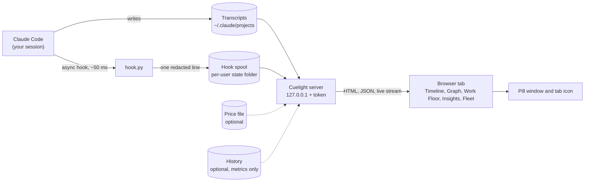
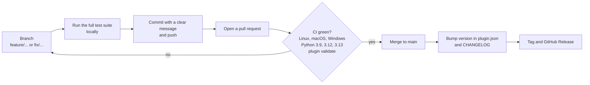

# Cuelight workflow, end to end

One page that follows a Claude Code session through Cuelight, from the first hook event to the
pill on your screen, and then covers how changes to Cuelight itself get released.
The deep reference is [ARCHITECTURE.md](ARCHITECTURE.md); the threat model is [../SECURITY.md](../SECURITY.md).

## 1. What happens when you use it

1. **You work in Claude Code.** It writes transcripts as it always does. Cuelight's hooks (installed with the
   plugin) add one line to a spool file on each of seven events: session start/end, subagent start/stop,
   notification, API failure and turn end. They never block Claude Code and always exit 0.
2. **You run `/cuelight:open`.** Claude runs one command that starts the server (or reuses it) and prints a
   URL with a private token. The server reads the transcripts and the spool and rebuilds the run.
3. **The dashboard stays live.** The server pushes changes over a live stream; the page redraws. When
   nothing has asked it for anything for 30 minutes, the server shuts itself down.
4. **The pill and tab icon watch for you.** They show the same face for the same facts, so you see the
   state with the dashboard in the background.

## 2. How an agent's state is decided

| Status | Meaning | How it is decided |
|---|---|---|
| running | working now | open round, activity within 5 minutes |
| completed | finished | the round has an end and a result |
| failed | died or errored | closed as failed, or the session ended while it held a tool call |
| stalled | probably stuck | open round, session live, no activity for more than 5 minutes |
| orphaned | session ended with it open | open round, session no longer live, not mid-tool-call |
| waiting | blocked on you | would be running or stalled, but a permission or input prompt appeared (from the hooks) and no activity has followed it |
| unknown | no evidence it started | no rounds at all |

A session counts as live if its transcript changed within the last 10 minutes. Both thresholds can be changed
(`ORCHESTRA_STALL_SECONDS`, `ORCHESTRA_SESSION_LIVE_SECONDS`).

## 3. What the pill and tab icon say

| Kind | Face | Meaning |
|---|---|---|
| idle | asleep | nothing running, nothing waiting |
| running | smiling, ring circling | at least one agent is working |
| permission | surprised, hopping | a session is waiting for your permission |
| input | surprised, hopping | a session is waiting for your input |
| error | worried, shaking | a session hit an API error |

A badge shows how many sessions are waiting when more than one is. A waiting session always outranks a running one.

## 4. What to do when it tells you something

| You see | Do this |
|---|---|
| Waiting for permission or input | Switch to that terminal and answer. The Fleet tab shows which session and project |
| A stalled agent | Open its drawer. If it is looping, the Insights tab shows the repeated step; stop it in Claude Code |
| A failed agent | Open its drawer for the last tool call and message; the Graph shows what depended on it |
| A write conflict | Two agents wrote the same file; check the Work Floor and the file before merging |
| Cost higher than expected | Insights shows spend by agent and cache hits; supply a price file for real numbers |

Cuelight only observes. Every fix happens in Claude Code.

## 5. Changing Cuelight itself

- **Tests:** `python -m unittest discover -s tests -t . -v` (standard library only).
- **Plugin checks:** `claude plugin validate --strict .claude-plugin/plugin.json` and the same for
  `marketplace.json`; `tests/test_directory_readiness.py` mirrors Anthropic's directory checklist.
- **Versions:** installed copies stay on the `version` in `.claude-plugin/plugin.json` until it changes, so
  every user-visible change needs a bump. Details in [../CONTRIBUTING.md](../CONTRIBUTING.md).
- **Submitting to Anthropic's directory:** see [SUBMISSION.md](SUBMISSION.md).
