# Evidence: what was run and what it looked like

This folder is proof of work for the Cuelight 0.4.0 build (the rename PR; the work itself landed in PRs #1 and #2): the test
results and screenshots, regenerated from the final build, with the scripts that make them.

| File | What it is |
|---|---|
| [`test-run.txt`](test-run.txt) | The full local test run: commit, tool versions, a per-module table, and every test by name with its result |
| [`screenshots/`](screenshots) | 18 screenshots of the dashboard running against the built-in demo |
| [`run_tests.py`](run_tests.py) | Runs the suite and rewrites `test-run.txt` |
| [`capture.mjs`](capture.mjs) | Rewrites every screenshot from a running demo |

## Result

**772 tests, 769 passed, 3 skipped, 0 failed** (local run, Windows, Python 3.11, Node 24).
The 3 skips check POSIX permissions, ownership and symlinks, which Windows does not have.

What the tests cover, in plain terms:

- **Maths with hand-computed answers**: parallelism, the critical path (overlap counted once,
  cycles terminate), cache-hit ratio, cost per model, the budget forecast.
- **Safety**: a redacted secret cannot be probed through search; hostile agent names, file
  paths and tool targets are shown as text in every new view; the report cannot be broken by
  `</script>` in a brief.
- **Layout**: no two graph nodes overlap, children line up with their parents, crossings are
  untangled, 200 agents lay out quickly.
- **Interaction**: palette results and highlighting, keyboard shortcuts (never while typing),
  deep links, theme, the Work Floor grouping and its skip-when-unchanged behaviour.
- **Accessibility**: text and status colours meet WCAG 4.5:1 in both themes
  (`tests/test_contrast.py` reads the real tokens).

## What this does not show

- **It is a local run.** GitHub Actions has not run on these commits: the account's billing
  state stops jobs from starting (no steps run). The macOS and Windows/Linux matrix is
  therefore unverified for the later commits until that is fixed.
- **The data is synthetic.** Every screenshot is the scripted 13-agent demo
  (`python -m orchestra --demo`), not a real Claude Code session, so the agent names and
  project path (`northwind-shop`) are made up.
- **The hook payload field names** behind the "waiting on permission" banner are checked
  against the docs, not against a captured live payload.

## Screenshots

All taken in headless Chrome from the demo at the sizes shown.

### Timeline
Live clock, stat strip with a budget meter, a pending permission prompt, alert chips, the
critical path outlined, a comb of tool-call ticks on each bar, and a "now" marker.

| Light | Dark |
|---|---|
| 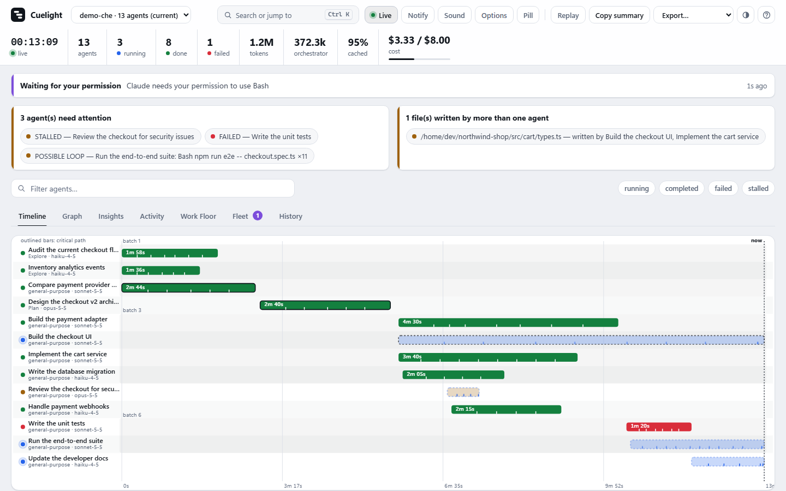 |  |

### Insights
Parallelism, critical path, tool use, cache efficiency, spend with a budget forecast, files.

| Light | Dark |
|---|---|
| 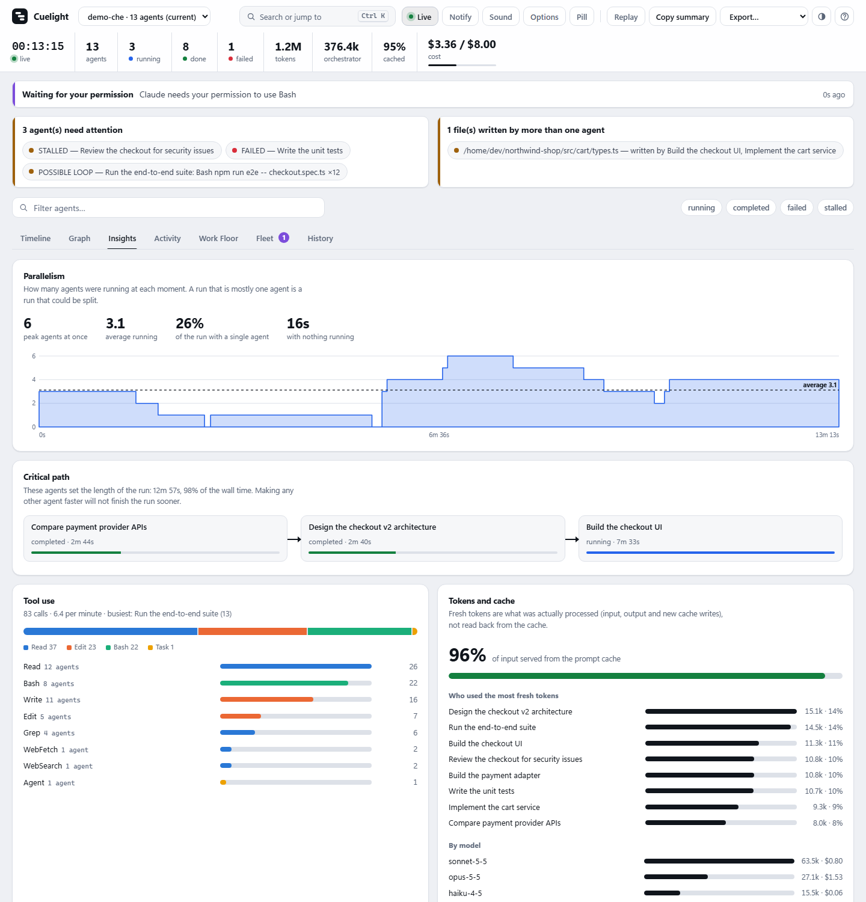 | 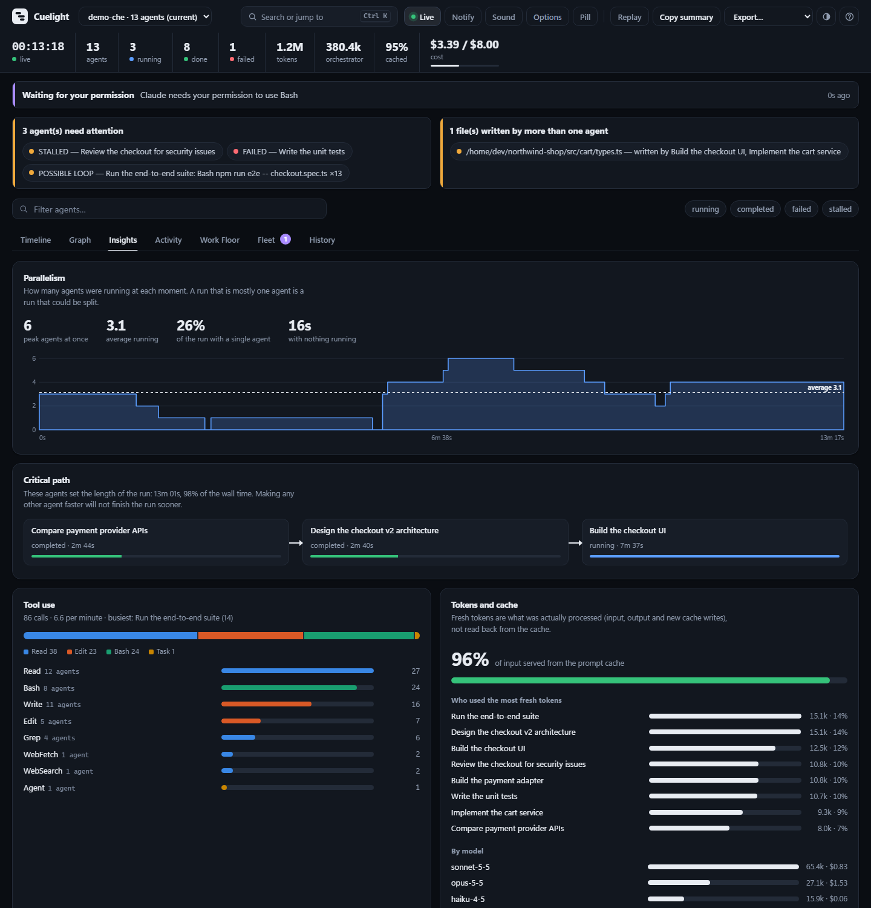 |

### Graph
Layered layout; the orchestrator's launch fan is drawn only where it explains something.
The last image is a synthetic 36-agent run to show the layout at scale.

| Light | Dark |
|---|---|
|  | 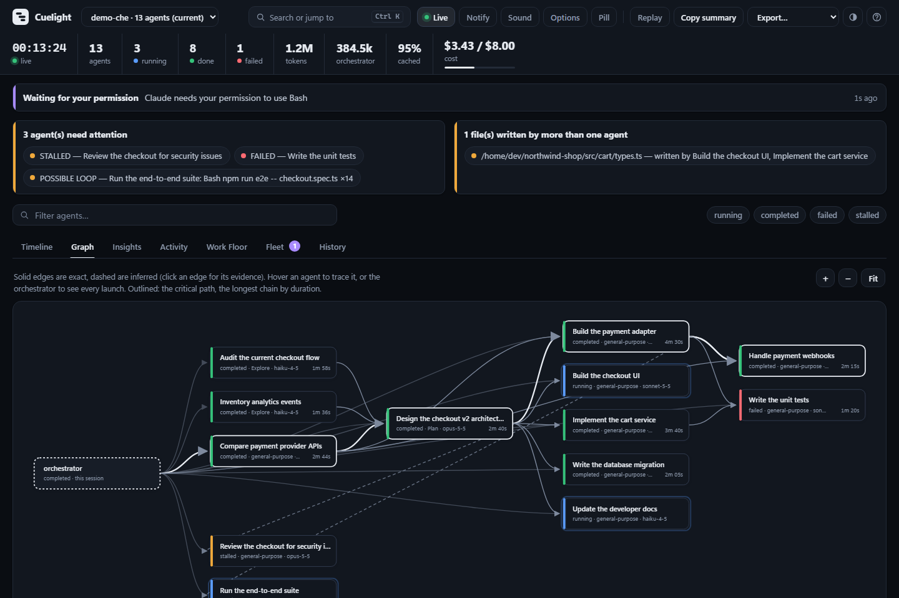 |

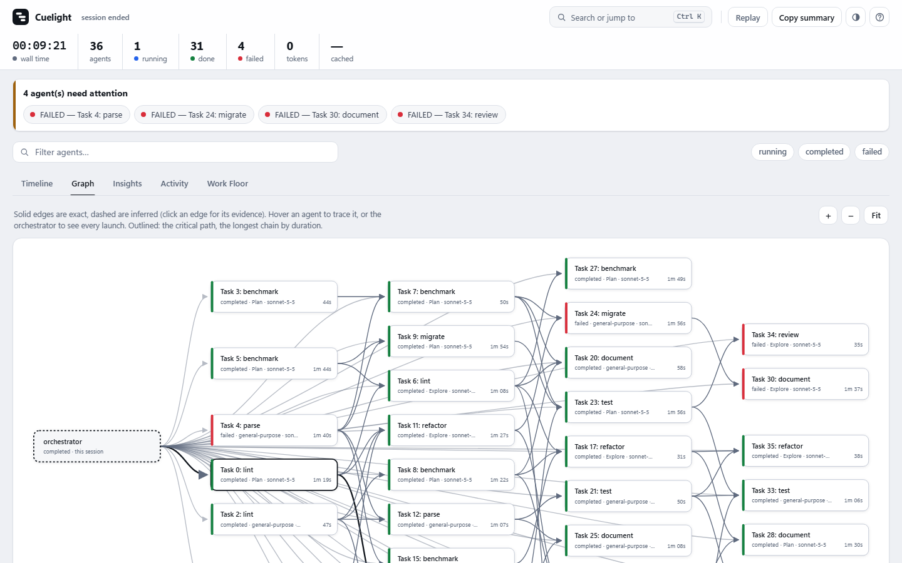

### Work Floor
Each card shows what the agent is doing now and where it has been busy; group by role or status.

| By role (light) | By status (dark) |
|---|---|
|  | 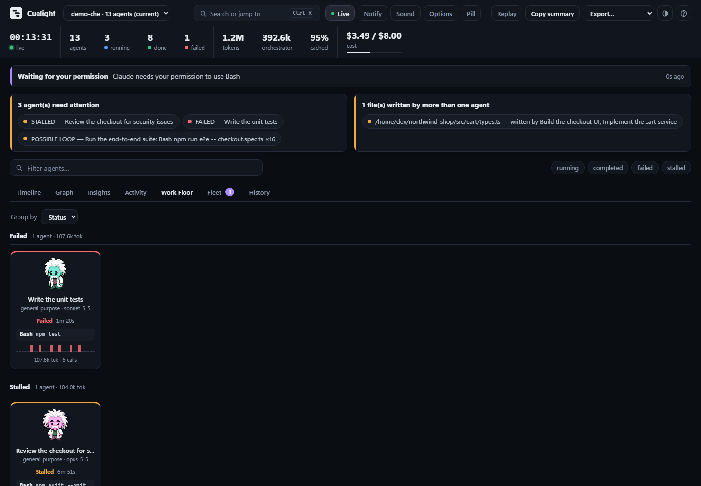 |

### Search and shortcuts
`Ctrl/Cmd+K`. The second shot searches for a loop: the repeated identical calls collapse into one row with a count (x10 or more).

| Search | A loop in search | Shortcuts |
|---|---|---|
| 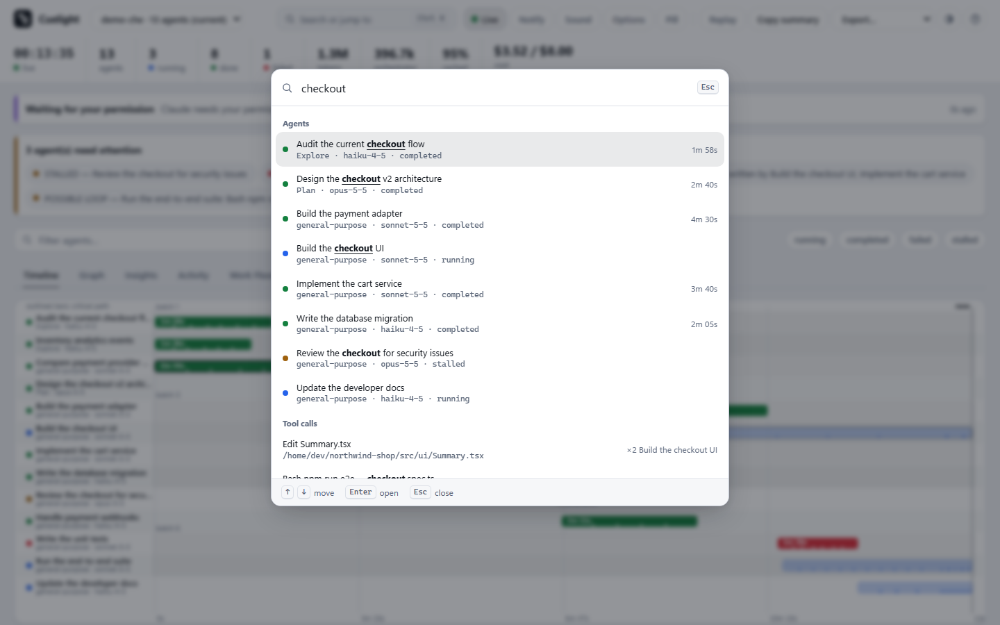 | 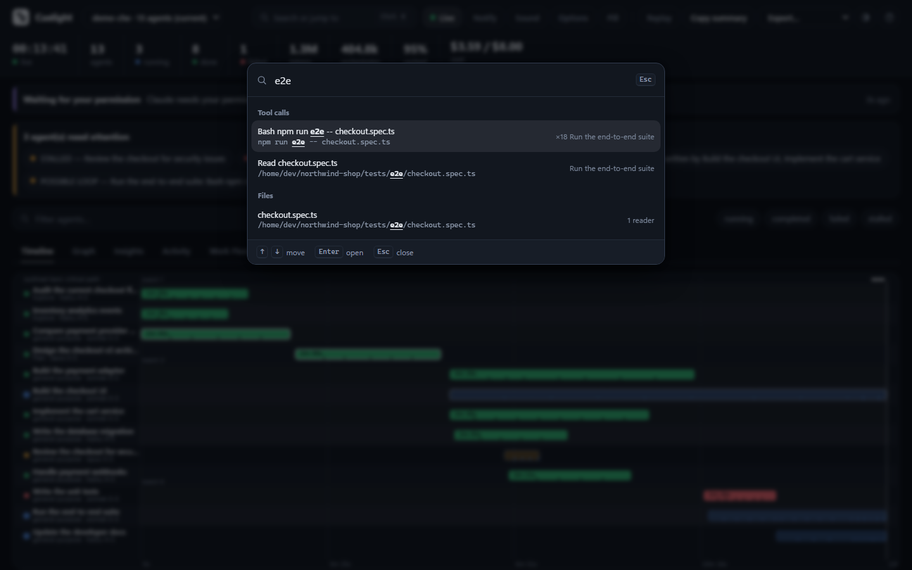 | 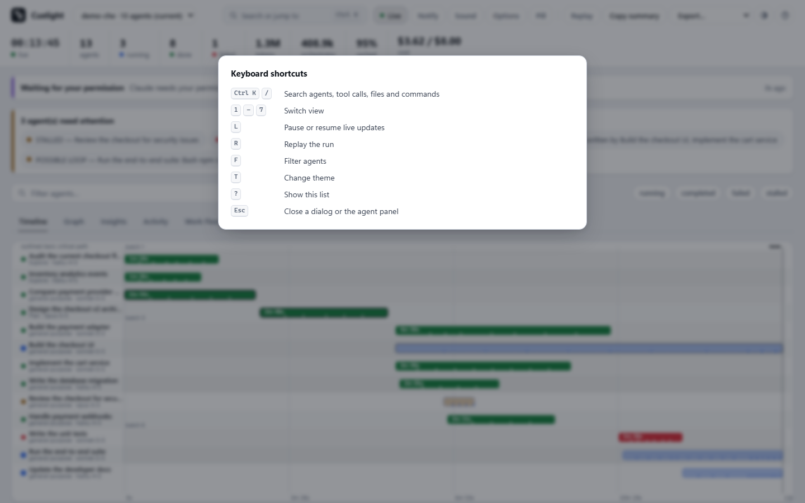 |

### Agent drawer and fleet

| Drawer (a failed agent) | Fleet |
|---|---|
| 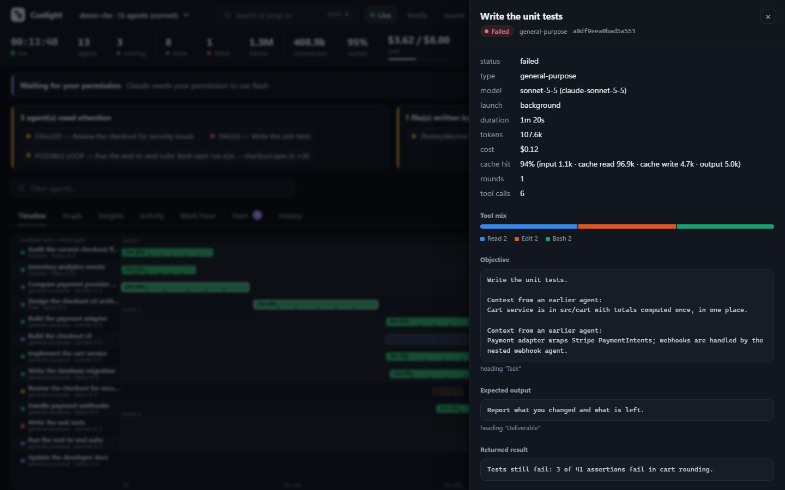 | 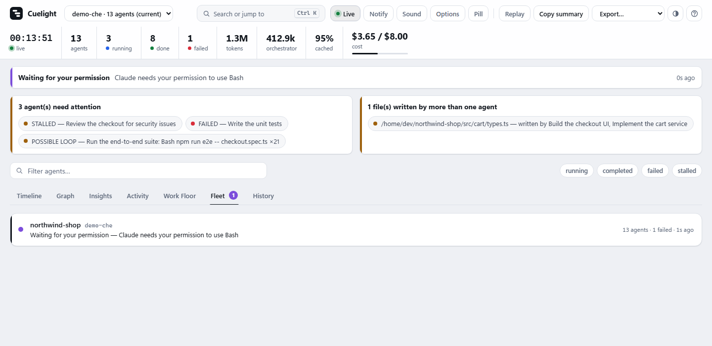 |

### Phone width (390 px)

| Timeline | Insights |
|---|---|
| 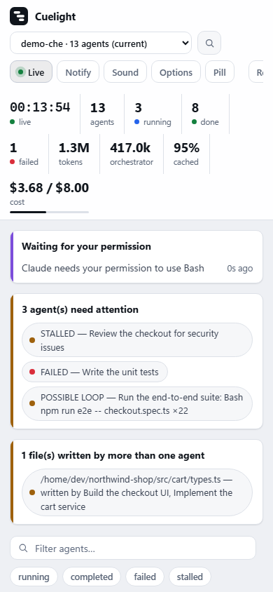 | 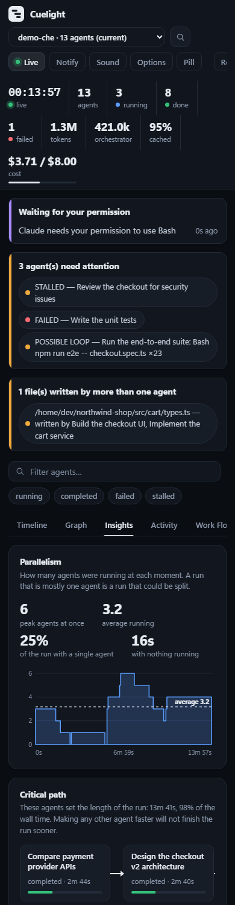 |

### Static report (one HTML file, no server)
Opened straight from disk: server-only controls are gone, "wall time" replaces the live
clock, and search works over the details baked into the file.

| Insights | Search |
|---|---|
| 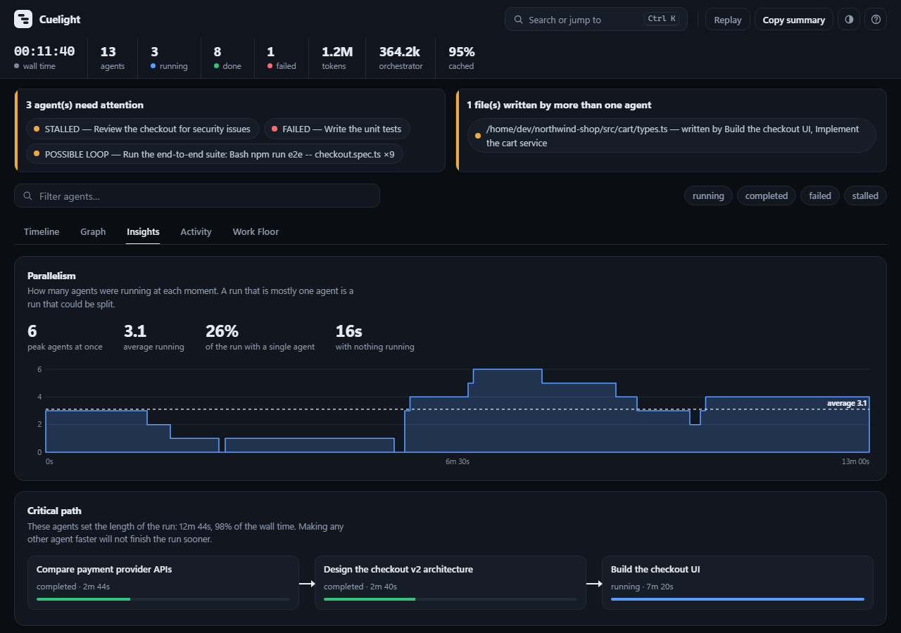 | 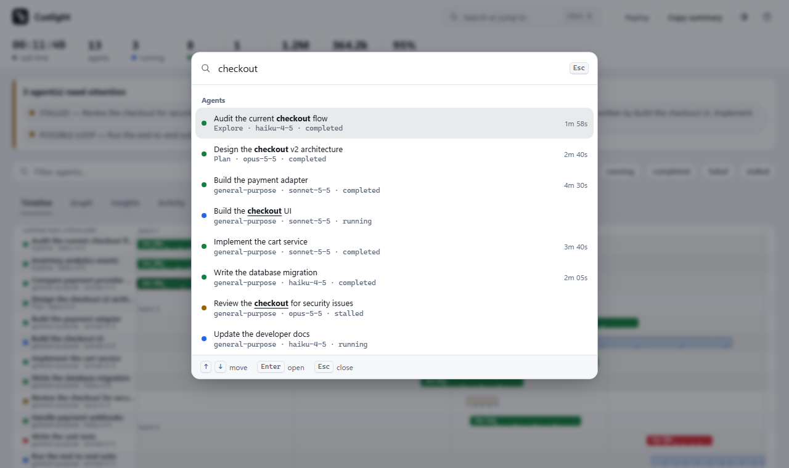 |

## Reproduce

```bash
python docs/evidence/run_tests.py                         # rewrites test-run.txt

python -m orchestra --demo --no-open --port 8766 --token demo   # leave running
node docs/evidence/capture.mjs                            # rewrites screenshots/
```

`capture.mjs` needs Node 22+ and Chrome or Edge (`CHROME_PATH` if not in a standard place). It
uses its own throwaway browser profile and closes only that process. Set `REPORT_URL` and
`BIG_REPORT_URL` to `file://` URLs of two static reports to include shots 16, 17 and 18.
